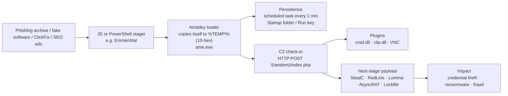

# 3. Threat Profile — Amadey

| Field | Value |
|---|---|
| Names | Amadey, Amadey Bot, Amadey Loader |
| MITRE ATT&CK ID | **S1025** (Malware, Windows) — v1.1, last modified 12 May 2026 |
| First seen | ~October 2018 |
| Type | Trojan loader + botnet → **modular RAT** since v5 |
| Language / platform | C++, Windows x86/x64 |
| Business model | **MaaS** — sold on Russian-speaking forums (≈ $500 at launch, per Malpedia) |
| Motivation | Financial |
| Known users | Many affiliates; ATT&CK links **TA505 (G0092)** and **Kimsuky (G0094)** |
| Typical payloads | StealC, RedLine, Lumma, Rhadamanthys, AsyncRAT, miners, **LockBit 3.0** |
| Geo-fencing | Avoids Russian systems (T1614 — locale/keyboard check) |
| Status (Oct 2026) | Disrupted by **Operation Endgame** (24 Jun 2026) — 326 servers / 142 domains taken down across StealC + Amadey infrastructure; ≈ 140k infected PCs, ≈ 27M stolen credentials tracked. Disrupted ≠ dead: MaaS kits usually come back with new infrastructure. |

---

## 3.1 Timeline

| Date | Event | Source |
|---|---|---|
| Oct 2018 | Amadey appears on Russian-speaking forums | Malpedia / ATT&CK |
| 2019 | Used by TA505 in campaigns | ATT&CK S1025 |
| Jul 2022 | v3.21 distributed via **SmokeLoader** disguised as cracks | AhnLab ASEC |
| Nov 2022 | Amadey seen delivering **LockBit 3.0** ransomware | AhnLab ASEC |
| 2023 | v3.8x–v4 widely tracked; Splunk publishes detections | Splunk Threat Research |
| Feb–Apr 2025 | **MaaS operation**: Emmenhtal JS loader → Amadey → payloads hosted on **GitHub** repos (account `Legendary99999`, 160+ repos) | Cisco Talos (Jul 2025) |
| Dec 2025 | Amadey **5.70** pulls StealC from a **compromised self-hosted GitLab** | Trellix |
| 2025–2026 | v5.x (5.60 → 5.87): full RAT — 19 commands (IDs 10–29), VNC, SOCKS, RDP, hidden admin | Microsoft, binaryanalys.is |
| 24 Jun 2026 | **Operation Endgame** + Microsoft DCU disrupt Amadey & StealC | Microsoft, Europol, Help Net Security |

## 3.2 Infection chain (2025–2026 campaigns)

## 3.3 Technical characteristics

### Install & persistence

| Artefact | Detail |
|---|---|
| Install path | `%TEMP%\<10 hex chars>\<random>.exe` (older), configurable in v5: `%APPDATA%`, `%TEMP%`, `%USERPROFILE%`, Desktop. Windows 10/11 sample in Microsoft report used `C:\Users\<user>\e079729711\nudwee.exe`. |
| Example names | `bguuwe.exe` (ASEC, v3.21), `oneext.exe` (Splunk, v3.83), `Yfgfwb.exe` (Trellix, v5.70), `nudwee.exe` (Microsoft, v5.x) |
| Scheduled task | Task named after the EXE, trigger **every 1 minute** (`schtasks /Create /SC MINUTE /MO 1 …` in v3/v4; COM `ITaskScheduler` in v5) |
| Registry | Startup folder redirected via `HKCU\…\Explorer\User Shell Folders\Startup` (T1547.001); payloads prefixed with `!` get Run keys (v5); `RunOnce` cleanup on uninstall |
| Mark-of-the-Web | Zeroes `Zone.Identifier` ADS (T1553.005) |
| Mutex | Prevents double infection, e.g. `f936986d553273aef6eeaeef713ad28f` (Trellix) |

### C2 protocol

| Version | Format |
|---|---|
| v3 / v4 | Plain HTTP POST to `/<path>/index.php` with `id=…&vs=…&sd=…&os=…&bi=…&ar=…&pc=…&un=…&dm=…&av=…&lv=…&og=…` |
| v5 | Step 1: `st=s` → server replies sleep time `<c>5<d>`. Step 2: `r=<hex(RC4(system info))>`. Tasks returned between `<c>` and `<d>`, separated by `#`. |

| Parameter | Meaning |
|---|---|
| `id` | Bot ID (derived from SID) |
| `vs` | Version (e.g. 5.70) |
| `sd` | Campaign / build ID (6 hex) |
| `os` | Windows version code |
| `bi` | 32/64-bit |
| `ar` | Admin rights |
| `pc`, `un`, `dm` | Computer, user, DNS domain |
| `av` | Detected AV product code (Defender = 13) |
| `lv`, `og` | Level / original-vs-crypted stub |

### Plugins

| Plugin | Purpose | Launch |
|---|---|---|
| `cred.dll` / `cred64.dll` | Credential theft (browsers, mail, FTP) | `rundll32.exe <path>\cred64.dll, Main` |
| `clip.dll` / `clip64.dll` | Clipboard hijack (crypto-wallet swap) | `rundll32.exe <path>\clip64.dll, Main` |
| VNC (v5) | Hidden remote desktop (`hVNC_Rules` handshake, TCP 777) | Command 0x17 |

## 3.4 MITRE ATT&CK mapping

**Official S1025 techniques (17)** — tactics per **ATT&CK v19** (2026), where the old *Defense Evasion* tactic was split into **Stealth (TA0005)** and **Defense Impairment (TA0112)**:

| Tactic | ID | Technique | How Amadey uses it |
|---|---|---|---|
| Execution | T1106 | Native API | `CreateProcessA`, `GetComputerNameA` |
| Persistence, Privilege Escalation | T1547.001 | Registry Run Keys / Startup Folder | Changes Startup folder registry value |
| Stealth | T1027 | Obfuscated Files or Information | Encoded AV names, domains, filenames |
| Stealth | T1140 | Deobfuscate/Decode | Decodes strings at runtime |
| Defense Impairment, Persistence | T1112 | Modify Registry | Overwrites keys for persistence |
| Defense Impairment | T1553.005 | Mark-of-the-Web Bypass | Zeroes `Zone.Identifier` |
| Discovery | T1082 | System Information Discovery | Computer name, OS version |
| Discovery | T1016 | System Network Configuration Discovery | Victim IP |
| Discovery | T1033 | System Owner/User Discovery | `GetUserNameA` |
| Discovery | T1083 | File and Directory Discovery | Looks for AV folders |
| Discovery | T1518.001 | Security Software Discovery | AV product list (`av=` param) |
| Discovery | T1614 | System Location Discovery | Skips Russian systems |
| Collection | T1005 | Data from Local System | Host data |
| Command & Control | T1071.001 | Web Protocols | HTTP C2 |
| Command & Control | T1568.001 | Fast Flux DNS | Hides C2 |
| Command & Control | T1105 | Ingress Tool Transfer | Downloads payloads |
| Exfiltration | T1041 | Exfiltration Over C2 Channel | Sends victim data |

**Additional techniques seen in 2022–2026 reports (not yet on S1025 page):**

| ID | Technique | Evidence |
|---|---|---|
| T1053.005 | Scheduled Task | ASEC, Splunk, Microsoft, Trellix |
| T1218.011 | Rundll32 | Plugin loading (`cred64.dll`, `clip64.dll`) |
| T1059.001 / .003 | PowerShell / cmd | v5 commands 0x0C, 0x0E; Trellix `Expand-Archive` |
| T1115 | Clipboard Data | `clip.dll` |
| T1555.003 | Credentials from Web Browsers | `cred.dll`, StealC |
| T1113 | Screen Capture | v5 command 0x14 |
| T1090 | Proxy | v5 SOCKS proxy |
| T1021.001 / T1136.001 | RDP / Create Local Account | v5 commands 0x18 / 0x19 |
| T1686 | Disable or Modify System Firewall (was T1562.004 before v19) | v5 command 0x18 opens firewall rules for RDP |
| T1566.001 | Spearphishing Attachment | Talos 2025 — seen with the linked SmokeLoader campaign; *likely* for the Amadey Emmenhtal scripts (Talos' assessment) |

## 3.5 Why Amadey is a good hunting target

1. **Stable TTPs, unstable IOCs** — hashes and C2s rotate constantly; the 1-minute task, `%TEMP%\<hex>\` path, `rundll32 … , Main` plugins and `index.php` POST pattern survive across versions (top of the Pyramid of Pain).
2. **Early in the chain** — catching Amadey stops the ransomware/stealer that follows.
3. **Rich public data** — ATT&CK page, vendor reports with IOCs, STIX bundles → good material for Weeks 2–3.

---

### Sources
- MITRE ATT&CK S1025 — https://attack.mitre.org/software/S1025/
- Microsoft Security Blog, 24 Jun 2026 — https://www.microsoft.com/en-us/security/blog/2026/06/24/stealc-and-amadey-breaking-down-infostealers-and-the-cybercrime-services-that-deliver-them/
- Cisco Talos, 17 Jul 2025 — https://blog.talosintelligence.com/maas-operation-using-emmenhtal-and-amadey-linked-to-threats-against-ukrainian-entities/
- Trellix, 18 Dec 2025 — https://www.trellix.com/blogs/research/amadey-exploiting-self-hosted-gitlab-to-distribute-stealc/
- binaryanalys.is — *Unmasking Amadey 5* — https://www.binaryanalys.is/posts/amadey
- Splunk Threat Research — https://www.splunk.com/en_us/blog/security/amadey-threat-analysis-and-detections.html
- AhnLab ASEC — https://asec.ahnlab.com/en/36634/ · https://asec.ahnlab.com/en/41450/
- Help Net Security, 24 Jun 2026 — https://www.helpnetsecurity.com/2026/06/24/operation-endgame-stealc-amadey-malware-disrupted/
