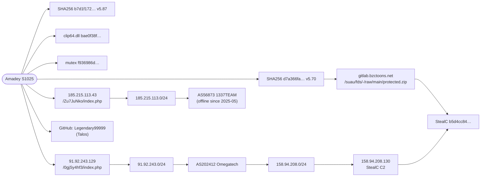

# 2. OSINT Collection — VirusTotal, Shodan, Maltego

> **Syllabus task (Week 2):** *Perform OSINT data collection using Shodan, VirusTotal, and Maltego.*
> Seeds: [`data/vt_targets.txt`](data/vt_targets.txt) (12 indicators), [`data/ip_targets.txt`](data/ip_targets.txt) (7 IPs).

---

## 2.1 VirusTotal

**Goal:** confirm the samples are Amadey, get first-seen dates, file names, sandbox behaviour, and network relations for pivoting.

### Manual procedure (GUI)

| Step | Where in VT | What I record |
|---|---|---|
| 1 | Search the SHA-256 | Detection ratio, *popular threat label* (expect `trojan.amadey/…`), first submission date |
| 2 | **Details** tab | File type, size, PE compile time, other file names (`Yfgfwb.exe`, …) |
| 3 | **Behavior** tab | Process tree (`schtasks.exe`, `rundll32.exe`), registry keys, mutexes, dropped files under `%TEMP%\<hex>\` |
| 4 | **Relations** tab | Contacted URLs/IPs/domains → new C2 candidates; *Dropped files* → plugins |
| 5 | Search IP / domain | Passive DNS, communicating files, detection ratio |

### Scripted procedure (API v3)

```bash
# Windows: set VT_API_KEY=xxxx   |  Linux/macOS: export VT_API_KEY=xxxx
python scripts/vt_lookup.py data/vt_targets.txt -o data/enrichment/vt_results.csv
```
Read-only (no uploads), respects the free quota (4 req/min) — 12 targets ≈ 3 minutes.

### What to look for (hunting value)

| Field in VT | Why it matters for this hunt |
|---|---|
| `popular_threat_classification` | Confirms family → the report's attribution is corroborated by a second source (raises confidence) |
| Behavior → *Scheduled tasks* | Verifies the 1-minute task TTP for **these** samples, not just the reports |
| Behavior → *Mutexes* | Host-based IOC that can be hunted with EDR |
| Relations → *Contacted URLs* matching `/<8–12 chars>/index.php` | New Amadey C2s not in any report → **new intelligence** |

### Results (2026-10-02, VirusTotal web GUI, no API key)

Full table: [`data/enrichment/vt_results_2026-10-02.csv`](data/enrichment/vt_results_2026-10-02.csv) · screenshots: [`evidence/virustotal/`](evidence/virustotal/)

| Group | Checked | Found in VT | Not in VT | AV family labels (top) |
|---|---|---|---|---|
| Trellix (Amadey 5.70 + clip64 + StealC) | 3 | 3 | 0 | amadey · clipbanker · stealc |
| Microsoft Amadey 5.60–5.87 | 11 | 6 | **5** | amadey (+ zusy, mikey, lumma) |
| Microsoft StealC | 4 | 3 | **1** | stealc · marte |
| Splunk (v3.83 era + plugins) | 4 | 4 | 0 | amadey · clipper · stealer |
| Talos campaign (unlabelled) | 4 of 6 | 4 | 0 | **3 × JS downloader** (adbr/dwnldr) + 1 × amadey |
| **Total** | **26** | **20** | **6** | 2 Talos hashes not checked — VT rate limit (captcha) |

Detection ratios of the Amadey binaries: **43/53 – 63/70**. Main sample `d7a366fa…` (Trellix, v5.70): **54/70**, label `trojan.amadey/mikey`, names `0bxbzsqjw.exe` / `Yfgfwb.exe`, PE64 (MSVC 2019), compiled 2025-11-11, first submitted 2025-11-20.

**What VT added (pivoting from `d7a366fa…`)** → [`data/enrichment/vt_pivot_new_leads_2026-10-02.csv`](data/enrichment/vt_pivot_new_leads_2026-10-02.csv)

| Lead | Evidence | Why it matters |
|---|---|---|
| `hxxp://gitd3ti.vokasi.uns[.]ac[.]id/Aubin/vrms-backend/-/raw/development/werdigo.exe` (0/98, HTTP 200) | Relations → contacted URLs | **New:** a *second* compromised self-hosted GitLab (Indonesian university, `203.6.149.147`, AS55684) used as payload host — not in any vendor report |
| `hxxp://91.92.243[.]129/0gjSy4hf3/Plugins/clip64.dll` (21/94) | Relations → contacted URLs | Plugin download path pattern `/<panel>/Plugins/<plugin>.dll` |
| `…/0gjSy4hf3/index.php?scr=1` (13/98) | Relations → contacted URLs | `scr=1` = screenshot upload to the panel (v5 screenshot command) |
| Mutex `f936986d553273aef6eeaeef713ad28f` | Behavior → mutexes created | **Confirms** the Trellix mutex in independent sandbox runs |
| `C:\Windows\Tasks\Yfgfwb.job` + `C:\Windows\System32\Tasks\Yfgfwb` | Behavior → files written / registry (TaskCache) | **Confirms** persistence; a legacy Task Scheduler 1.0 `.job` file is rare on Windows 10/11 → strong hunting signal |
| `%TEMP%\10000210101\exe.exe` | Behavior → processes created | Next-stage drop folder `%TEMP%\1000xxxxxxx\` (Trellix saw `%TEMP%\10000340261\`) → hunt the pattern, not the name |

**VT findings**

1. **VT coverage is incomplete:** 6 of 15 Microsoft hashes are **not in VirusTotal** → vendors publish hashes from private telemetry; "not on VT" ≠ "not malicious".
2. **Attribution check works:** 3 of 4 Talos "campaign" hashes are **JavaScript downloaders**, not Amadey — exactly why Week 3 tags them `Amadey-campaign` with lower confidence instead of `Amadey`.
3. **Labels disagree sometimes:** Splunk's "Amadey" `617f4082…` is an IExpress/WEXTRACT dropper that AV engines call stealer/ursnif; Microsoft's StealC `2a0f0538…` was seen in the wild as `amadey_x64.exe`. A second source is needed before trusting a label.
4. **Pivoting found new infrastructure** (second compromised GitLab) with **0 detections** — something IOC lists alone would never show.

---

## 2.2 Shodan

**Goal:** check whether the reported infrastructure is still alive and what it runs (passive — data comes from Shodan's own scans).

### Queries

| # | Query / lookup | Purpose |
|---|---|---|
| Q1 | `internetdb.shodan.io/<ip>` (no key) | Quick: open ports, hostnames, CPEs |
| Q2 | Host page / `shodan host <ip>` | Banners, HTTP title, server software, last scan date |
| Q3 | `net:185.215.113.0/24` | Whole bulletproof range that hosted Amadey C2 + payload server |
| Q4 | `asn:AS202412 http.title:"login"` | Panels in the same ASN as the Trellix Amadey C2 — *candidates only*, verify in VT |
| Q5 | `hostname:bzctoons.net` / `ssl.cert.subject.cn:"gitlab.bzctoons.net"` | Compromised GitLab server details |

> Free accounts can't use every filter (Q3/Q4 may need a membership). Q1 works without an account; Q2 with a free API key via `scripts/shodan_lookup.py`.

```bash
python scripts/shodan_lookup.py data/ip_targets.txt --internetdb -o data/enrichment/internetdb.csv
python scripts/shodan_lookup.py data/ip_targets.txt -o data/enrichment/shodan_hosts.csv   # needs SHODAN_API_KEY
```

### Results (2026-10-02)

Shodan host pages (web, no login) → [`data/enrichment/shodan_hosts_2026-10-02.csv`](data/enrichment/shodan_hosts_2026-10-02.csv) · screenshots: [`evidence/shodan/`](evidence/shodan/)
Registry data (RIPEstat) → [`data/enrichment/infrastructure_enrichment_2026-10-02.csv`](data/enrichment/infrastructure_enrichment_2026-10-02.csv)

| IP | Role (source) | RIPE: ASN / holder | Prefix announced? | Shodan host page (last seen) | VT |
|---|---|---|---|---|---|
| `185.215.113.43` | Amadey C2 (Talos) | AS56873 ELITETEAM / 1337TEAM, SC | ❌ since **2025-05-02** | no information | 15/91 |
| `185.215.113.16` | Payload host `amnew.exe` (Talos) | AS56873 | ❌ | no information | — |
| `185.215.113.209` / `.75` | Network IOC (Talos) | AS56873 | ❌ | no information | — |
| `185.156.73.73` | Network IOC (Talos) | AS39238 OKB PROGRESS, RU | ✅ | no information | — |
| `91.92.243.129` | Amadey C2 (Trellix) | **AS202412 Omegatech LTD**, US | ✅ | **live** (2026-09-28): port 80, Microsoft IIS 10.0 answering 404; Shodan shows NL / Neterra–NTT AS2914 | 10/91 |
| `158.94.208.130` | StealC C2 (Trellix) | **AS202412 Omegatech LTD**, DE | ✅ | **live** (2026-10-02): ports 22, 80, 135, 443, 445, 3389, 9090; hostname `natureofarizona.com`; self-signed cert; Windows 11 + Debian/Apache banners | — |

### Findings

1. **Shared hosting provider:** the Amadey C2 and the StealC C2 of the same campaign sit in the **same ASN and org (AS202412, ORG-OL329-RIPE)** even though they are registered in different countries (US/DE). Hosting choice is a *procedure* — more stable than a single IP.
2. **Dead infrastructure:** the whole `185.215.113.0/24` range (AS56873) **stopped being announced in BGP on 2025-05-02** — right after the Talos campaign window (Feb–Apr 2025) — and Shodan has no data for any of its IPs. Blocking those IPs today has near-zero value.
3. **IOC decay / re-use:** `158.94.208.130` now serves an unrelated-looking hostname with SMB/RDP open — the IP was probably **re-assigned**. Blocking it blindly could hit an innocent host → in Week 3 such IOCs get `to_ids = false` and an expiry date.
4. **Sources disagree:** for `91.92.243.129` RIPE/VT say AS202412 (US) while Shodan's scan says AS2914 (NL). Registry data (RIPE) is authoritative for *allocation*; Shodan reflects what it saw when scanning. Recording both — with dates — is part of good collection.

---

## 2.3 Maltego

**Goal:** visual link analysis — show how samples, C2s, IPs, netblocks and ASNs connect, and find pivots.

### Procedure (done 2026-10-03, Maltego Graph (Desktop) 4.13.0, free Community Edition)

1. **Build the graph file.** Maltego's *Import Graph from Table* maps one column to *one* entity type, but my link list mixes types per row (Hash → URL, URL → IPv4, Netblock → AS …). So [`scripts/build_maltego_graph.py`](scripts/build_maltego_graph.py) writes the Maltego graph format (`.mtgx` = zip with GraphML) directly from [`data/maltego_graph_import.csv`](data/maltego_graph_import.csv): **36 entities, 40 links** (33 links from the reports + 7 from my VirusTotal pivots). Value properties follow Maltego's Standard Entities Catalog (`maltego.Hash` → `properties.hash`, `maltego.AS` → `as.number`, …).
2. *Open* [`data/amadey_graph.mtgx`](data/amadey_graph.mtgx) → all entities typed and labelled → *Organic* layout.
3. Transforms (free *Standard Transforms*, run on Maltego's servers, so my PC never touched attacker infrastructure; **0 credits used**):

| Input (selected by type) | Transform | Result |
|---|---|---|
| 6 Domains | `To DNS Name - NS (name server)` | 12 NS records (4 domains answered, the 2 sub-domains had no NS) |
| 7 IPv4 Addresses | `To Location [city, country]` | 4 locations |
| 7 IPv4 Addresses | `To DNS Name [Reverse DNS]` | 1 PTR record (6 timed out — typical for malicious hosting) |

4. Export: graph image → [`evidence/maltego/`](evidence/maltego/), link table → [`data/enrichment/maltego_export_links_2026-10-03.csv`](data/enrichment/maltego_export_links_2026-10-03.csv), enriched graph → [`data/amadey_graph_enriched.mtgl`](data/amadey_graph_enriched.mtgl). Final graph: **53 entities, 60 links**.

Transforms I deliberately did **not** run: *Attempt zone transfer*, *Find common DNS names* and *Name Schema dictionary* — they request zone transfers from, or brute-force names against, the target's own DNS (active reconnaissance, outside my passive-only OPSEC rule).

### Results (2026-10-03)

| Pivot | Maltego result | Meaning |
|---|---|---|
| `goodpanelforgoodjob.com` (Amadey C2, Microsoft 24 Jun 2026) | NS `nsb22a/nsb22b.microsoftinternetsafety.net` | `microsoftinternetsafety.net` is **Microsoft's sinkhole name-server domain** (Alowaisheq et al., NDSS 2019, Table I) → the C2 domain was **taken over/sinkholed** |
| `microsoft-telemetry.at` (Amadey C2, same report) | NS `ns1–ns4.csof.net` | `csof.net` serves ~21,000 domains, mostly random-looking names — looks like a sinkhole or parking operator, **operator not confirmed** (open question) |
| `203.6.149.147` (IP of the compromised GitLab `gitd3ti.vokasi.uns.ac.id`) | PTR `smtp.mipa.uns.ac.id`, location Indonesia | The IP belongs to the **university's own mail/web infrastructure** → confirms a *legitimate compromised host*: block the URL path, not the IP |
| `bzctoons.net` (compromised GitLab, Trellix) | NS `ns1–ns4.bzctoons.net` | Self-hosted DNS of the legitimate site — nothing to block |
| `natureofarizona.com` (current hostname of ex-StealC IP) | NS on Cloudflare | Ordinary site → supports "IP was re-assigned" |
| `185.215.113.16/.43/.75/.209` | Location Seychelles | Same offshore /24 (AS56873), offline since 2025-05 |
| `158.94.208.130` / `91.92.243.129` | Frankfurt (DE) / New York (US) | **Shodan said London (UK) / Amsterdam (NL)** → geolocation differs per database |

### Findings

1. **A C2 domain from the June 2026 Microsoft report is sinkholed.** Its name servers now belong to Microsoft. For a hunter this flips the indicator's use: blocking it is pointless, but **any internal host that still resolves `goodpanelforgoodjob.com` is very likely infected** → perfect *hunting* indicator for DNS logs (Sysmon EID 22 / DNS server logs).
2. **Pivoting on the new VirusTotal lead worked:** the second compromised GitLab resolves to a university mail server (`smtp.mipa.uns.ac.id`), so the attackers abused a legitimate institution's server rather than renting their own.
3. **Geolocation is a low-confidence attribute.** Two tools gave different countries for the same two IPs on the same day. Registry data (RIPE) answers *who owns the block*; GeoIP answers *where a database thinks it is*. Record the source and date for every value.
4. **Infrastructure pivot still holds:** Amadey C2 `91.92.243.129` → `91.92.243.0/24` → **AS202412** → `158.94.208.0/24` → StealC C2 `158.94.208.130`.

Sources for the name-server attribution: [Alowaisheq et al., *Cracking the Wall of Confinement: Understanding and Analyzing Malicious Domain Take-downs*, NDSS 2019](https://www.ndss-symposium.org/wp-content/uploads/2019/02/ndss2019_02B-1_Alowaisheq_paper.pdf) (Table I lists `*.microsoftinternetsafety.net` as Microsoft's sinkhole NS) · [who.is — ns1.csof.net](https://who.is/nameserver/ns1.csof.net) (domain count).

### Pivot graph (simplified — full Maltego export: [`evidence/maltego/maltego_01_amadey-graph_53-entities_60-links.png`](evidence/maltego/maltego_01_amadey-graph_53-entities_60-links.png))



**Pivot logic:** Amadey sample → its C2 → netblock → ASN → *another* malware's C2 in the same ASN (StealC). That's how one IOC turns into a picture of an operator's infrastructure — and why the **hosting ASN** is worth monitoring even after single IPs die.

---

## 2.4 Evidence

Screenshots to include for the defense are listed in [`evidence/README.md`](evidence/README.md).
