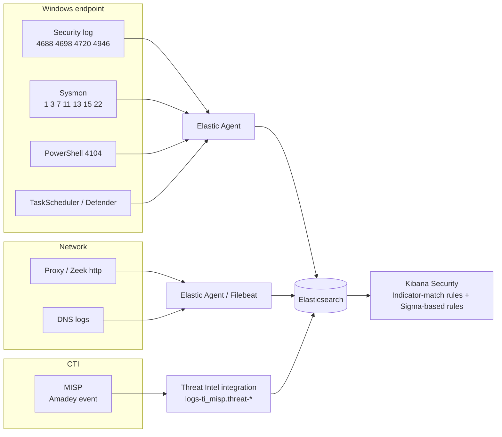

# 3. Data Source Mapping for Amadey

> **Syllabus task (Week 2):** *Develop a data source mapping for analysis.*
> Question (PIR-3): **which logs would actually show an Amadey infection, and do I collect them?**
> “Lab status” refers to my course SIEM lab: Windows Server VM → standalone Elastic Agent (System + Windows + Custom Windows Event Log integrations, 4688 with command line, PowerShell Script Block Logging) → Elasticsearch/Kibana 9.4 on CentOS.

## 3.1 Behaviour → ATT&CK → log source → fields

| # | Amadey behaviour | ATT&CK | ATT&CK data component | Log source / event | Key fields (ECS) | Lab status |
|---|---|---|---|---|---|---|
| 1 | Dropped EXE runs from `%TEMP%\<10-hex>\name.exe` | T1204.002, T1106 | Process Creation | **Sysmon 1**, Security **4688** | `process.executable`, `process.parent.name`, `process.hash.sha256` | ✅ 4688 · ⚠️ Sysmon not installed |
| 2 | Scheduled task, every 1 min | **T1053.005** | Scheduled Job Creation | Security **4698**, TaskScheduler/Operational **106**, Sysmon 1 (`schtasks.exe`) | `winlog.event_data.TaskName`, `TaskContent`, `process.command_line` | ✅ (needs *Audit Other Object Access Events*) |
| 3 | Startup folder redirected / Run key | **T1547.001**, T1112 | Windows Registry Key Modification | **Sysmon 13** (4657 only with SACL) | `registry.path`, `registry.data.strings` | ⚠️ Sysmon needed |
| 4 | Zone.Identifier zeroed (MotW bypass) | T1553.005 | File Metadata | **Sysmon 15** (FileCreateStreamHash) | `file.path` ends `:Zone.Identifier` | ⚠️ Sysmon needed |
| 5 | Plugins `cred64.dll` / `clip64.dll` via rundll32 | T1218.011, T1555.003, T1115 | Process Creation, Module Load | Sysmon **1** + **7**, 4688 | `process.command_line`, `dll.path` | ✅ 4688 · ⚠️ Sysmon 7 |
| 6 | PowerShell (v5 cmd 0x0E, `Expand-Archive`) | T1059.001 | Script Execution | PowerShell **4104** | `powershell.file.script_block_text` | ✅ |
| 7 | C2 check-in `POST /<rand>/index.php` | **T1071.001** | Network Traffic Content | Proxy / Zeek `http.log`, Suricata | `http.request.method`, `url.path`, `destination.ip`, `user_agent.original` | ❌ no proxy/NSM in lab |
| 8 | Outbound connection to C2 | T1071.001, T1041 | Network Connection Creation | **Sysmon 3**, WFP **5156** | `destination.ip`, `destination.port`, `process.executable` | ⚠️ Sysmon / ✅ 5156 if audited |
| 9 | DNS for C2 domains (fast flux) | T1568.001 | Domain Name / DNS query | **Sysmon 22**, DNS server logs | `dns.question.name`, `dns.resolved_ip` | ⚠️ Sysmon needed |
| 10 | Next-stage download (StealC, …) | **T1105** | File Creation, Network Traffic | **Sysmon 11**, proxy | `file.path`, `file.hash.*`, `url.full` | ⚠️ |
| 11 | RDP enabled (`fDenyTSConnections=0`) + firewall rule | T1021.001, T1686 | Registry Modification, Firewall Rule Modification | Sysmon 13, Security **4946**, Firewall log **2004** | `registry.path`, `winlog.event_data.RuleName` | ⚠️ / ✅ 4946 |
| 12 | Hidden admin account | T1136.001, T1098 | User Account Creation | Security **4720**, **4732** | `user.target.name`, `group.name` | ✅ |
| 13 | Security software discovery | T1518.001 | Process/API | EDR only | — | ❌ |
| 14 | AV detection of the sample | — | — | Defender/Operational **1116/1117** | `rule.name` (e.g. `Trojan:Win32/Amadey`) | ✅ (Custom Windows Event Log integration) |

## 3.2 Data source inventory

| Data source | Collector | Where it lands | Value for Amadey | Volume | Priority |
|---|---|---|---|---|---|
| Windows Security log | Elastic Agent – System integration | `logs-system.security-*` | 4688, 4698, 4720/4732, 4946 | Medium | **P1** |
| Sysmon | Elastic Agent – Windows integration (`sysmon_operational`) | `logs-windows.sysmon_operational-*` | 1, 3, 7, 11, 13, 15, 22 — best single source | High | **P1 (gap)** |
| PowerShell Operational | Windows integration | `logs-windows.powershell_operational-*` | 4104 script blocks | Medium | P2 |
| Task Scheduler Operational | Custom Windows Event Log | `logs-winlog.winlog-*` | 106 task registered, 200/201 | Low | P2 |
| Defender Operational | Custom Windows Event Log | `logs-winlog.winlog-*` | 1116/1117 family names | Low | P2 |
| Proxy / Zeek HTTP | Zeek/Squid + Elastic Agent | `logs-zeek.http-*` | POST `/…/index.php`, UA, bytes | High | P1 (gap) |
| DNS server logs | Windows DNS / Zeek dns | `logs-zeek.dns-*` | Fast-flux domains | High | P2 |
| CTI (MISP) | Elastic **Threat Intel – MISP** integration | `logs-ti_misp.threat-*` | IOC matching (Week 3) | Low | **P1** |

## 3.3 Data flow

## 3.4 Coverage summary & gaps

| | Count (of 14 behaviours) |
|---|---|
| ✅ Visible in my lab now (at least partly) | **7** — #1, #2, #5, #6, #11, #12, #14 (4688 process creation, scheduled task, PowerShell, firewall rule, hidden admin, Defender) |
| ⚠️ Visible after installing **Sysmon** | **5** — #3, #4, #8, #9, #10 (registry, ADS, network connections, DNS, file creation) |
| ❌ Needs network sensor / EDR | **2** — #7 (C2 HTTP content), #13 (API-level AV discovery) |

**Recommendations**
1. **Install Sysmon** (SwiftOnSecurity or Olaf Hartong config) on the Windows VM and enable the Sysmon data stream in the Windows integration — closes the biggest gap (registry, DNS, network, image loads).
2. Enable *Audit Other Object Access Events* → 4698 scheduled-task creation.
3. Add a proxy or Zeek sensor if resources allow — the only place the `index.php` C2 pattern is visible.
4. Feed MISP into Elastic via the **Threat Intel → MISP** integration so IOC matches run automatically (Week 3).
