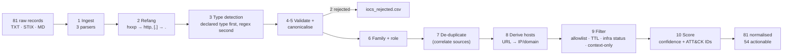

# 3. Filtering & Normalisation of the Collected Data

> **Syllabus task (Week 3):** *Apply filtering and normalization techniques to collected data.*
> Input: 6 raw files from Week 2 (`week-02-data-collection/data/raw/`). Code: [`scripts/normalize_iocs.py`](scripts/normalize_iocs.py) (Python stdlib only). Auto-generated report: [`output/pipeline_report.md`](output/pipeline_report.md).

## 3.1 Why process at all?

The five reports describe the same malware in **five different formats**: plain text, STIX 2.1, two Markdown table layouts, with three defanging styles, mixed malware families, broken values and no expiry dates. Loading that straight into a SIEM would produce missed matches (defanged values never match), false positives (re-used IPs) and alert fatigue.

## 3.2 Pipeline



| # | Technique | What exactly is done | Example |
|---|---|---|---|
| 1 | **Ingest / parse** | One parser per format: TXT lines, STIX 2.1 `indicator.pattern` (regex on `file:hashes.SHA256`, `url:value`, `dst_ref.value`), Markdown tables with header detection (`Indicator` vs `Value` column) | Microsoft table vs Trellix table have different column orders → same output |
| 2 | **Refang** | `hxxp→http`, `[.]→.`, `[:]→:` | `hxxp://rebustan[.]top/gd7djkDveE2/index.php` → `http://rebustan.top/…` (27 values) |
| 3 | **Type detection** | Vendor's declared type wins; otherwise regex (hex length, IPv4, scheme) | Trellix mutex `f936986d553273aef6eeaeef713ad28f` is 32 hex → regex alone would call it **MD5** ❌ |
| 4 | **Validation** | Hash = hex + exact length; IPv4 = valid + globally routable; domain = RFC-style labels; URL = scheme + host | 2 Talos SHA-256 with **63 chars** → rejected |
| 5 | **Canonicalisation** | Lower-case hashes/domains/URL scheme+host, keep URL path case (`/0gjSy4hf3/` is case-sensitive), normalise env-vars `%appdata%` → `%APPDATA%\` | Prevents “same IOC, two spellings” |
| 6 | **Attribution** | Family from description (`StealC` vs `Amadey`), role: `sample`, `plugin`, `c2`, `payload-host`, `host-artefact`, `context`; Talos list has no per-IOC labels → `Amadey-campaign` | 20 StealC records separated from Amadey |
| 7 | **De-duplication** | Key = (type, value); merge sources, keep earliest `first_seen` / latest `last_seen` | 13 Talos values were in both TXT and STIX |
| 8 | **Derivation** | Extract host from each URL as its own IP/domain indicator (`derived = true`) | `http://svclsc.com/ms/index.php` → `svclsc.com` |
| 9 | **Filtering** | (a) allowlist of legit services, (b) compromised-but-legit parent domains, (c) **TTL**: IP 90 d, domain/URL 180 d, hashes never, (d) Week-2 infra status (BGP withdrawn / re-assigned IP), (e) context-only artefacts | `185.215.113.43` → expired **and** prefix withdrawn |
| 10 | **Scoring + tags** | Confidence = 70 (Admiralty A2) +10 per extra publisher −20 unlabelled −10 derived −20 expired → High/Medium/Low; deprecated ATT&CK IDs mapped (T1158 → T1564.001; T1562.004 → T1686 in v19) | Talos hash = *Medium (50)*; Microsoft C2 URL = *High (70)* |

## 3.3 Results (as of 2026-10-02)

| Step | Records |
|---|---|
| Raw ingested | **81** |
| Rejected (malformed) | **2** |
| After de-duplication | 66 (13 duplicates) |
| After URL → host derivation | **81** normalised indicators (+15 derived) |
| **Actionable (`to_ids = true`)** | **54** |
| Context-only (kept for hunting/analysis) | 27 |

| Type | Total | Actionable |
|---|---|---|
| sha256 | 28 | 28 |
| url | 20 | 12 |
| domain | 15 | 12 |
| ip | 7 | **0** |
| filename | 4 | 0 |
| directory | 3 | 0 |
| mutex | 1 | 1 |
| scheduled task | 1 | 1 |
| bot ID / crypto key | 2 | 0 |

| Why not actionable | Count |
|---|---|
| Older than TTL | 18 |
| Weak alone (random file names / folders per build) | 7 |
| Infrastructure offline (BGP prefix withdrawn) | 6 |
| IP re-assigned to an unrelated host | 2 |
| Context only (bot ID, decryption key) | 2 |
| Compromised legitimate organisation (`bzctoons.net`) | 1 |

### Before → after examples

| Raw (as published) | Normalised | Decision |
|---|---|---|
| `hxxp://microsoft-telemetry[.]at/cvdfnaFJBmC0/index.php` | `http://microsoft-telemetry.at/cvdfnaFJBmC0/index.php` + derived `microsoft-telemetry.at` | ✅ IDS — Amadey C2, 100 days old |
| `91[.]92[.]243[.]129` | `91.92.243.129` | ❌ expired (288 d > 90 d) |
| `185[.]215[.]113[.]43` | `185.215.113.43` | ❌ expired + /24 withdrawn from BGP since 2025-05-02 |
| `158[.]94[.]208[.]130` | `158.94.208.130` | ❌ expired + now hosts an unrelated website |
| `4e3951e6…a8f8b` (63 chars) | — | ❌ rejected: truncated hash |
| `bzctoons[.]net` | `bzctoons.net` | ❌ legit org whose GitLab was abused — block the URL, not the org |
| `f936986d553273aef6eeaeef713ad28f` (Mutex) | type **mutex**, not MD5 | ✅ host IOC for EDR hunting |
| `%APPDATA%\f936986d553273\` | `%APPDATA%\f936986d553273\` | ❌ IDS, ✅ hunting context |

## 3.4 Key insights

1. **Zero overlap between publishers.** No indicator appears in more than one vendor's report — each report saw a *different* campaign/build. IOC sharing alone gives narrow coverage → **behaviour-based** detection is needed (Sigma rules in [`04-exploitation-elastic-sigma.md`](04-exploitation-elastic-sigma.md)).
2. **All 7 IPs are dead or re-used**; none are safe to block today. Hashes and recent domains are what remain actionable — consistent with the Pyramid of Pain (IPs are the most volatile network IOC).
3. **Declared type beats regex.** Two 32-hex values (mutex, decryption key) would be mis-typed as MD5 by naïve tools, including MISP's freetext parser.
4. **Families must be separated.** 20 of 79 valid records are StealC — tagging them “Amadey” would mislead any analyst pivoting from an alert.
5. **Data quality issues exist even in top-tier sources** (truncated hashes in Talos TXT, deprecated ATT&CK ID in Talos STIX) — validation is not optional.

## 3.5 Output files

| File | Use |
|---|---|
| [`output/iocs_normalized.csv`](output/iocs_normalized.csv) / [`.json`](output/iocs_normalized.json) | Master list: type, value, family, role, to_ids, confidence, first/last seen, expiry, sources, reasons |
| [`output/iocs_rejected.csv`](output/iocs_rejected.csv) | What was dropped and why |
| [`output/blocklists/`](output/blocklists/) | `sha256.txt` (28), `domain.txt` (12), `url.txt` (12), `ip.txt` (0) — plain lists for firewall/EDR |
| [`output/misp/`](output/misp/) | MISP event JSON + freetext list |
| [`output/elastic/`](output/elastic/) | ECS threat-indicator NDJSON + index mapping |
| [`output/pipeline_report.md`](output/pipeline_report.md) | Auto-generated statistics |

Reproduce:
```bash
cd week-03-data-processing/scripts
python normalize_iocs.py --as-of 2026-10-02
python build_misp_event.py
python to_elastic_ndjson.py
python gen_sigma_ioc_rules.py
python convert_sigma.py          # needs: pip install sigma-cli pySigma-backend-elasticsearch
```
Run without `--as-of` to re-evaluate TTLs for today's date — indicators automatically drop out of the actionable set as they age.
