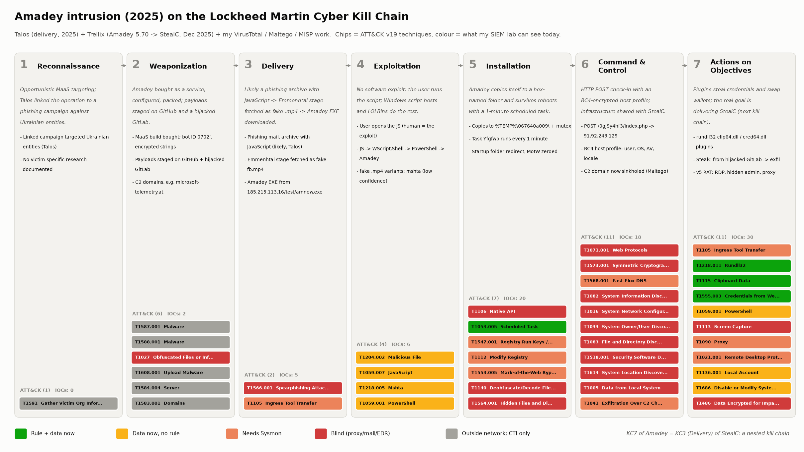

# 2. Real-world attack on the Kill Chain — Amadey → StealC (2025)

> **Syllabus task 1:** *Analyze a real-world cyberattack using the stages of the Kill Chain.*

## 2.1 The attack I analyse and why

**Attack:** an Amadey MaaS intrusion that ends with the **StealC** infostealer on the victim — the chain documented in 2025 by Cisco Talos (delivery side) and Trellix (installation → StealC side), cross-checked with my own data from Weeks 2–3.

| Why this attack | |
|---|---|
| Real and recent | Two vendor investigations from 2025 + Microsoft's June 2026 takedown report |
| Fully observable | IOCs, host artefacts and C2 protocol are public; I already processed them (81 normalised IOCs, MISP events #1–#3) |
| Own evidence | VirusTotal sandbox of the Trellix sample `d7a366fa…`, Maltego pivots, Shodan — not just copied from a blog |
| Good teaching case | Shows the classic chain **and** its limits (no exploit, nested chains, MaaS actors) |

### Sources and reliability (Admiralty)

| Key | Source | Covers phases | Rating |
|---|---|---|---|
| Talos | Cisco Talos, *MaaS operation using Emmenhtal and Amadey linked to threats against Ukrainian entities*, 17 Jul 2025 | 1–4, 6 | A2 |
| Trellix | Trellix ARC, *Amadey Exploiting Self-Hosted GitLab to Distribute StealC*, 18 Dec 2025 | 2, 5–7 | A2 |
| Microsoft | Microsoft Threat Intelligence, *StealC and Amadey …*, 24 Jun 2026 | 2, 6, takedown | A2 |
| binaryanalys.is | *Unmasking Amadey 5* (v5 protocol and commands) | 6–7 | B2 |
| ASEC | AhnLab, Amadey delivering LockBit 3.0, Nov 2022 | 7 (historical) | A2 |
| Mine | VirusTotal relations + sandbox (W2), Maltego (W2), MISP (W3) | 2, 5–7 | — (my own analysis) |

**Intelligence gap (stated, not hidden):** Trellix analysed the sample but did not observe *how* it reached victims. For phases 1–4 I use the Talos campaign of the **same malware family in the same year** — an explicit assumption, marked in the confidence column of [`03-attack-mapping.md`](03-attack-mapping.md).

**What Talos actually observed:** phishing e-mails against Ukrainian entities delivered Emmenhtal → **SmokeLoader**. The Emmenhtal samples that delivered **Amadey** were found in public GitHub repositories, not in e-mails; Talos links the two clusters by near-identical code and *assesses* that the Amadey scripts were likely meant for phishing too. So the phishing step (T1566.001) is medium confidence, not high.

## 2.2 Timeline

| Date | Event | Source |
|---|---|---|
| Oct 2018 | Amadey sold as MaaS on Russian-speaking forums | Malpedia / ATT&CK S1025 |
| Feb–Apr 2025 | MaaS operation: Emmenhtal loader → Amadey → payloads hosted on GitHub; linked by code overlap to a SmokeLoader phishing campaign against Ukrainian entities | Talos |
| 11 Nov 2025 | Compile time of Amadey 5.70 sample `d7a366fa…` | VirusTotal (mine) |
| 20 Nov 2025 | First submission of `d7a366fa…` to VirusTotal | VirusTotal (mine) |
| 18 Dec 2025 | Trellix: Amadey 5.70 pulls StealC from a hijacked self-hosted GitLab | Trellix |
| 24 Jun 2026 | Operation Endgame + Microsoft DCU disrupt Amadey/StealC infrastructure | Microsoft, Europol |
| 2–3 Oct 2026 | Amadey C2 `91.92.243.129` still answers (IIS 404); C2 domain `goodpanelforgoodjob.com` delegated to Microsoft's sinkhole name servers | Shodan, Maltego (mine) |

## 2.3 The chain at a glance

```mermaid
flowchart LR
    R["1 Recon<br/>linked campaign: Ukrainian orgs"] --> W["2 Weaponization<br/>MaaS build 0702f<br/>payloads on GitHub / hijacked GitLab"]
    W --> D["3 Delivery<br/>phishing archive (JS), likely<br/>fake fb.mp4, amnew.exe"]
    D --> E["4 Exploitation<br/>user runs JS<br/>WScript.Shell → PowerShell"]
    E --> I["5 Installation<br/>%TEMP%\067640a009\Yfgfwb.exe<br/>task every 1 min"]
    I --> C["6 C2<br/>POST /0gjSy4hf3/index.php<br/>91.92.243.129"]
    C --> A["7 Actions on Objectives<br/>clip64/cred64 plugins<br/>StealC download"]
    A -.->|"= Delivery of the next chain"| S["StealC kill chain<br/>3 Delivery → … → 7 credential theft<br/>exfil to 158.94.208.130"]
```

## 2.4 Phase-by-phase analysis

Each phase lists **what happened**, the **evidence**, the **indicators** from my Week 3 dataset, and **what a defender could see**. ATT&CK IDs are ATT&CK v19 (validated against the official STIX bundle 19.2 by [`scripts/build_kill_chain.py`](scripts/build_kill_chain.py)).

### Phase 1 — Reconnaissance

- **What happened:** the affiliate chose a target set and a lure theme. Talos links the operation to a phishing campaign against Ukrainian organisations (which delivered SmokeLoader). Amadey is a commodity loader: no victim-specific research is documented — volume over precision.
- **ATT&CK:** T1591 *Gather Victim Org Information* — **inferred, low confidence**.
- **Indicators:** none (0 of 81 IOCs).
- **Defender view:** invisible from inside the network; only CTI says "Ukrainian organisations were targeted" (by the linked campaign).

### Phase 2 — Weaponization

- **What happened:**
  - The **developer** sells Amadey as a service (T1587.001); the **affiliate** buys a build (T1588.001). The build carries config (bot ID `0702f`, string-decryption key `828065b4…`) and encrypted strings (T1027). The Emmenhtal JavaScript is multi-layer obfuscated (T1027).
  - Next-stage payloads are **staged in advance** (T1608.001):
    - on GitHub repos (account `Legendary99999`, Talos);
    - on a **hijacked self-hosted GitLab**, `gitlab.bzctoons.net/suau/fds` (T1584.004, Trellix).
    - My VirusTotal pivot found a **second** hijacked GitLab (`gitd3ti.vokasi.uns.ac.id`), which reverse-resolves to a university mail server (Maltego).
  - C2 domains are registered, some imitating brands, e.g. `microsoft-telemetry.at` (T1583.001).
- **Indicators:** 2 (bot ID, decryption key) + the staging hosts counted under Delivery/Actions.
- **Defender view:** outside my network → **CTI only** (VT, MISP, Maltego). This is where a takedown (*Destroy*) happens, not a SIEM rule.

### Phase 3 — Delivery

- **What happened:**
  - Phishing e-mails carried an **archive with a JavaScript file** (T1566.001). Talos saw this with the linked SmokeLoader campaign and assesses the Amadey-delivering Emmenhtal scripts were likely meant for the same delivery → **medium** confidence.
  - The Talos IOC list contains two `.mp4` URLs on `pivqmane[.]com` (`/doc/fb.mp4`, `/testonload.mp4`). Talos only says these Emmenhtal samples masquerade as MP4; running such fake media files with `mshta` is a known Emmenhtal pattern (Orange Cyberdefense).
  - The Amadey binary itself came from `http://185.215.113.16/test/amnew.exe` (T1105).
- **Indicators:** 5 (staging URLs, the domain and the IP).
- **Defender view:** mail gateway and proxy — **neither exists in my lab** → `T1566.001` blind. Downloads become visible with Sysmon 11/3.

### Phase 4 — Exploitation

- **What happened:** **no software vulnerability is exploited.** The victim opens the JavaScript (T1204.002), Windows Script Host runs it (T1059.007), `WScript.Shell` launches an encoded PowerShell command, and an AES-decrypted PowerShell layer downloads and starts the loader (T1059.001) — this is the chain Talos shows. For the fake-`.mp4` variants, `mshta.exe` is the likely runner (T1218.005, **low** confidence: not shown in Talos' samples). The "exploited component" is the human plus built-in Windows binaries (LOLBins).
- **Indicators:** 6 Talos campaign hashes. In Week 2, VirusTotal showed that 3 of the 4 I checked are JavaScript downloaders and 1 is Amadey itself; 2 are still unchecked.
- **Defender view:** **this is the earliest phase my lab can see today.** Security 4688 records `wscript.exe` → `powershell.exe` (and `mshta.exe http…` for the `.mp4` variants), and PowerShell 4104 records the script blocks. The data is there but **no rule exists yet** → the first hunting target for Week 5.
- **Lesson:** patching alone does not break this chain; controlling **script hosts (wscript, mshta) and PowerShell** does.

### Phase 5 — Installation

- **What happened (Trellix sample, confirmed in my VirusTotal sandbox review):**
  - Amadey copies itself to `%TEMP%\067640a009\Yfgfwb.exe` and starts the copy (T1106). Mutex `f936986d553273aef6eeaeef713ad28f` blocks double infection.
  - **Scheduled task** `Yfgfwb` (`C:\Windows\Tasks\Yfgfwb.job`) runs it **every minute** (T1053.005).
  - The Startup folder is redirected in the registry (T1547.001, T1112), Mark-of-the-Web is zeroed (T1553.005), and strings are decoded at runtime (T1140).
  - Talos' STIX also lists hidden files/directories, under the revoked ID T1158 → now **T1564.001**.
- **Indicators:** 20 (14 Amadey sample hashes + mutex, task, folders, file names).
- **Defender view:**
  - ✅ The scheduled-task rule (4688/4698) and the hex-folder EXE rule work **today**.
  - ⚠️ Registry and alternate data stream (ADS) evidence needs Sysmon 13/15.
  - ❌ API calls (T1106) and string decryption are invisible without an EDR.

### Phase 6 — Command & Control

- **What happened:**
  - v5 check-in: `POST /0gjSy4hf3/index.php` to `91.92.243.129` (AS202412).
  - The first request sends `st=s`. The second sends `r=<hex(RC4(profile))>` (T1071.001, T1573.001).
  - The profile reports computer, user and domain names, OS, admin rights, the AV product and a locale check that skips Russian systems: T1082, T1016, T1033, T1083, T1518.001, T1614, T1005. It travels over the same channel (T1041).
  - C2 hosts sit behind fast-flux DNS (T1568.001, ATT&CK S1025).
- **My own findings:**
  - The Amadey C2 and the StealC C2 share **AS202412**.
  - `91.92.243.129` still answered on 28 Sep 2026.
  - The Amadey C2 domain `goodpanelforgoodjob.com` (Microsoft report) is now on **Microsoft's sinkhole name servers**.
- **Indicators:** 18 (Amadey C2 domains, URLs and IPs + unlabelled Talos IPs).
- **Defender view:**
  - **My biggest blind spot: 9 of 11 techniques are invisible.**
  - The Sigma rule for the `index.php` POST already exists (Week 3), but there is **no proxy/Zeek sensor** to feed it → a *sensor* gap, not a *rule* gap.
  - DNS queries (Sysmon 22) plus MISP indicator matching would at least catch known and **sinkholed** domains.

### Phase 7 — Actions on Objectives

- **What happened:**
  - Amadey downloads plugins: `/0gjSy4hf3/Plugins/clip64.dll` (the URL is in my VirusTotal relations) (T1105).
  - The plugins run as `rundll32 <path>\clip64.dll, Main` (T1218.011): `clip64` swaps crypto-wallet addresses in the clipboard (T1115) and `cred64` steals browser credentials (T1555.003).
  - The real objective is the **StealC** delivery:
    - `protected.zip` is downloaded from the hijacked GitLab;
    - it is unpacked with PowerShell `Expand-Archive` (T1059.001) into `%TEMP%\10000340261\protected\`;
    - `x64_protect.exe` runs;
    - credentials are exfiltrated to `158.94.208.130` (T1555.003, T1041 in StealC's own chain).
  - Amadey v5 also offers:
    - screenshots (T1113) — `index.php?scr=1` appears in VirusTotal relations;
    - a SOCKS proxy (T1090);
    - enabling RDP, plus a hidden admin account and a firewall rule (T1021.001, T1136.001, T1686).
  - In 2022 the same loader delivered **LockBit 3.0** (T1486, ASEC). The impact depends on the paying customer.
- **Indicators:** 30 (3 plugin hashes, 5 StealC hashes, 16 StealC C2 indicators, StealC staging and host artefacts).
- **Defender view:**
  - ✅ The rundll32 plugin rule fires today.
  - New admin (4720/4732) and firewall rule (4946) events are in the lab, but there's no rule yet.
  - RDP enabling needs Sysmon 13.
  - Screen capture and the ransomware impact are out of reach without an EDR.

## 2.5 One intrusion, several chains and actors

| Actor | Runs phases | Evidence |
|---|---|---|
| Amadey developer | 2 (builder, panel, updates 5.60 → 5.87) | Microsoft hash list, MaaS model |
| Affiliate / campaign operator | 1, 3, 4, 6 (targets, phishing, C2 panel) | Talos campaign, C2 infrastructure |
| Payload customer (StealC / ransomware) | 7 — and their **own** chain 3–7 | Trellix StealC, ASEC LockBit 3.0 |

Amadey's phase 7 **is** StealC's phase 3. Defending against "Amadey" alone means losing sight of the next chain. Defending *early* (phase 4–5) stops **both** chains at once — the main argument for hunting loaders.

## 2.6 Indicators per phase (Week 3 dataset, 81 IOCs)

| Phase | IOCs | Share | Mostly |
|---|---|---|---|
| 1 Reconnaissance | 0 | 0 % | — |
| 2 Weaponization | 2 | 2 % | build config (bot ID, key) |
| 3 Delivery | 5 | 6 % | staging URLs/IPs |
| 4 Exploitation | 6 | 7 % | JS downloader hashes |
| 5 Installation | 20 | 25 % | Amadey hashes, host artefacts |
| 6 Command & Control | 18 | 22 % | C2 domains, URLs, IPs |
| 7 Actions on Objectives | 30 | 37 % | plugins, StealC samples and C2 |

**84 % of the public IOCs (68 of 81) describe phases 5–7** — *after* the code already runs. Vendor IOC lists tell you that you were hit, not how to stop the next hit. That's why Weeks 3–5 move from IOCs to **behaviour** (Sigma rules, hunts) in phases 4–5.
