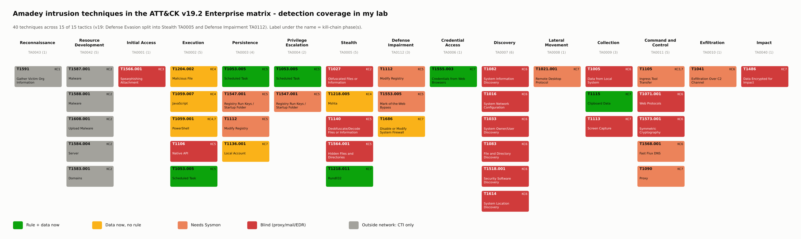

# 3. Mapping every phase to ATT&CK TTPs

> **Syllabus task 2:** *Map each stage to corresponding ATT&CK TTPs.*
> ATT&CK **Enterprise v19** (STIX bundle 19.2). Every ID below was checked by [`scripts/build_kill_chain.py`](scripts/build_kill_chain.py): it exists, is not revoked or deprecated, and its tactics come from the official data — not typed by hand.

## 3.1 Result in numbers

| Metric | Value |
|---|---|
| Kill-chain phases covered | **7 / 7** |
| Technique entries (phase × technique) | **42** |
| Unique techniques | **40** — all **17** official ATT&CK S1025 techniques (★) + **23** from the 2022–2026 reports and my own analysis |
| Tactics touched | **15 / 15** (v19: Stealth TA0005 and Defense Impairment TA0112 replace Defense Evasion) |
| Techniques in two phases | T1059.001 PowerShell (phase 4 exploitation and phase 7 `Expand-Archive`), T1105 Ingress Tool Transfer (phase 3 delivery and phase 7 plugins/StealC) |
| Corrected IDs | T1158 → **T1564.001** (deprecated in Talos' STIX), T1562.004 → **T1686** (revoked in v19) |

### Unique techniques per tactic

| Tactic (v19) | # | Tactic (v19) | # |
|---|---|---|---|
| Reconnaissance TA0043 | 1 | Credential Access TA0006 | 1 |
| Resource Development TA0042 | 5 | Discovery TA0007 | 6 |
| Initial Access TA0001 | 1 | Lateral Movement TA0008 | 1 |
| Execution TA0002 | 5 | Collection TA0009 | 3 |
| Persistence TA0003 | 4 | Command and Control TA0011 | 5 |
| Privilege Escalation TA0004 | 2 | Exfiltration TA0010 | 1 |
| Stealth TA0005 | 5 | Impact TA0040 | 1 |
| Defense Impairment TA0112 | 3 | | |

(Techniques with several tactics, e.g. T1053.005 Execution/Persistence/Privilege Escalation, count once per tactic.)

## 3.2 Full mapping

★ = listed on the official ATT&CK S1025 (Amadey) page. **My lab** = what my SIEM lab (Windows Server VM → Elastic Agent: 4688 with command line, 4104, 4698, 4720/4732, 4946, Defender) can see today:

- ✅ rule + data — a Week 3 Sigma rule exists and the data is collected
- **data, no rule** — huntable now (Week 5)
- ⚠️ needs Sysmon
- ❌ blind — needs a proxy, mail gateway or EDR
- CTI only — happens outside my network

| KC phase | ATT&CK v19 tactic(s) | ID | Technique | Amadey procedure in this intrusion | Conf. | My lab |
|---|---|---|---|---|---|---|
| 1 Reconnaissance | Reconnaissance | T1591 | Gather Victim Org Information | Choice of Ukrainian organisations as targets (inferred, low confidence) | low | CTI only |
| 2 Weaponization | Resource Development | T1587.001 | Malware | Amadey developed and sold as MaaS since 2018 (operator side) | high | CTI only |
| 2 Weaponization | Resource Development | T1588.001 | Malware | Affiliates buy Amadey builds (customer side) | high | CTI only |
| 2 Weaponization | Stealth | T1027 ★ | Obfuscated Files or Information | Encrypted strings in the build, obfuscated Emmenhtal JavaScript | high | ❌ blind |
| 2 Weaponization | Resource Development | T1608.001 | Upload Malware | Payloads staged in GitHub repos and in gitlab.bzctoons.net/suau/fds | high | CTI only |
| 2 Weaponization | Resource Development | T1584.004 | Server | Self-hosted GitLab servers hijacked (bzctoons.net; gitd3ti.vokasi.uns.ac.id from my VT pivot) | high | CTI only |
| 2 Weaponization | Resource Development | T1583.001 | Domains | C2 domains such as microsoft-telemetry.at, goodpanelforgoodjob.com | medium | CTI only |
| 3 Delivery | Initial Access | T1566.001 | Spearphishing Attachment | Archive attachment with JavaScript in phishing mail | high | ❌ blind |
| 3 Delivery | Command and Control | T1105 ★ | Ingress Tool Transfer | Emmenhtal stage and Amadey EXE downloaded over HTTP | high | ⚠️ needs Sysmon |
| 4 Exploitation | Execution | T1204.002 | Malicious File | User double-clicks the JS file from the archive | high | data, no rule (huntable) |
| 4 Exploitation | Execution | T1059.007 | JavaScript | JavaScript executed by Windows Script Host | high | data, no rule (huntable) |
| 4 Exploitation | Stealth | T1218.005 | Mshta | mshta.exe executes the remote Emmenhtal stage | high | data, no rule (huntable) |
| 4 Exploitation | Execution | T1059.001 | PowerShell | Emmenhtal PowerShell layer downloads/starts the loader | high | data, no rule (huntable) |
| 5 Installation | Execution | T1106 ★ | Native API | CreateProcessA starts the copied loader | high | ❌ blind |
| 5 Installation | Execution, Persistence, Privilege Escalation | T1053.005 | Scheduled Task | Task named after the EXE, trigger every 1 minute (confirmed in VT sandbox) | high | ✅ rule + data |
| 5 Installation | Persistence, Privilege Escalation | T1547.001 ★ | Registry Run Keys / Startup Folder | User Shell Folders\Startup redirected to the install folder | high | ⚠️ needs Sysmon |
| 5 Installation | Defense Impairment, Persistence | T1112 ★ | Modify Registry | Registry values overwritten for persistence | high | ⚠️ needs Sysmon |
| 5 Installation | Defense Impairment | T1553.005 ★ | Mark-of-the-Web Bypass | Zone.Identifier ADS zeroed so SmartScreen/MotW checks do not fire | high | ⚠️ needs Sysmon |
| 5 Installation | Stealth | T1140 ★ | Deobfuscate/Decode Files or Information | Encrypted strings (AV names, C2, file names) decoded at runtime | high | ❌ blind |
| 5 Installation | Stealth | T1564.001 | Hidden Files and Directories | Hidden files/directories (Talos STIX listed deprecated T1158) | medium | ❌ blind |
| 6 Command & Control | Command and Control | T1071.001 ★ | Web Protocols | HTTP POST to /<random>/index.php (Sigma rule ready, needs proxy logs) | high | ❌ blind |
| 6 Command & Control | Command and Control | T1573.001 | Symmetric Cryptography | v5 encrypts the host profile with RC4 before sending | medium | ❌ blind |
| 6 Command & Control | Command and Control | T1568.001 ★ | Fast Flux DNS | Fast-flux DNS hides C2 hosts (S1025) | medium | ⚠️ needs Sysmon |
| 6 Command & Control | Discovery | T1082 ★ | System Information Discovery | OS version, computer name in the check-in | high | ❌ blind |
| 6 Command & Control | Discovery | T1016 ★ | System Network Configuration Discovery | Victim IP / network configuration | high | ❌ blind |
| 6 Command & Control | Discovery | T1033 ★ | System Owner/User Discovery | User name (GetUserNameA) | high | ❌ blind |
| 6 Command & Control | Discovery | T1083 ★ | File and Directory Discovery | Looks for AV program folders | high | ❌ blind |
| 6 Command & Control | Discovery | T1518.001 ★ | Security Software Discovery | AV product code in the av= field | high | ❌ blind |
| 6 Command & Control | Discovery | T1614 ★ | System Location Discovery | Locale / keyboard check, exits on Russian systems | high | ❌ blind |
| 6 Command & Control | Collection | T1005 ★ | Data from Local System | Host data collected for the panel | high | ❌ blind |
| 6 Command & Control | Exfiltration | T1041 ★ | Exfiltration Over C2 Channel | Host profile sent over the C2 channel | high | ⚠️ needs Sysmon |
| 7 Actions on Objectives | Command and Control | T1105 ★ | Ingress Tool Transfer | Plugins and StealC downloaded (clip64.dll, protected.zip) | high | ⚠️ needs Sysmon |
| 7 Actions on Objectives | Stealth | T1218.011 | Rundll32 | rundll32 <path>\clip64.dll, Main | high | ✅ rule + data |
| 7 Actions on Objectives | Collection | T1115 | Clipboard Data | Clipper plugin replaces wallet addresses | high | ✅ rule + data |
| 7 Actions on Objectives | Credential Access | T1555.003 | Credentials from Web Browsers | cred64.dll and StealC steal browser credentials | high | ✅ rule + data |
| 7 Actions on Objectives | Execution | T1059.001 | PowerShell | PowerShell Expand-Archive unpacks protected.zip | high | data, no rule (huntable) |
| 7 Actions on Objectives | Collection | T1113 | Screen Capture | v5 command: screen capture | medium | ❌ blind |
| 7 Actions on Objectives | Command and Control | T1090 | Proxy | v5 command: SOCKS proxy through the victim | medium | ⚠️ needs Sysmon |
| 7 Actions on Objectives | Lateral Movement | T1021.001 | Remote Desktop Protocol | v5 command: enable RDP (fDenyTSConnections=0) | medium | ⚠️ needs Sysmon |
| 7 Actions on Objectives | Persistence | T1136.001 | Local Account | v5 command: hidden local admin account | medium | data, no rule (huntable) |
| 7 Actions on Objectives | Defense Impairment | T1686 | Disable or Modify System Firewall | v5 command: firewall rule for RDP (was T1562.004 before v19) | medium | data, no rule (huntable) |
| 7 Actions on Objectives | Impact | T1486 | Data Encrypted for Impact | LockBit 3.0 delivered by Amadey (ASEC 2022) - customer-dependent impact | medium | ❌ blind |

## 3.3 Matrix view

## 3.4 ATT&CK Navigator layers

| Layer | Colour / score | Open directly in the Navigator |
|---|---|---|
| [`navigator/amadey_kill_chain_layer.json`](navigator/amadey_kill_chain_layer.json) | colour = kill-chain phase (legend KC1–KC7), comment = procedure per phase | [open layer](https://mitre-attack.github.io/attack-navigator/#layerURL=https%3A%2F%2Fraw.githubusercontent.com%2Fsheinorshin%2Famadey-threat-hunting%2Fmain%2Fweek-04-kill-chain%2Fnavigator%2Famadey_kill_chain_layer.json) |
| [`navigator/amadey_detection_coverage_layer.json`](navigator/amadey_detection_coverage_layer.json) | score 3 → 0 = rule → data → Sysmon → blind/CTI | [open layer](https://mitre-attack.github.io/attack-navigator/#layerURL=https%3A%2F%2Fraw.githubusercontent.com%2Fsheinorshin%2Famadey-threat-hunting%2Fmain%2Fweek-04-kill-chain%2Fnavigator%2Famadey_detection_coverage_layer.json) |

Manual: [ATT&CK Navigator](https://mitre-attack.github.io/attack-navigator/) → *Open Existing Layer* → *Upload from local* → choose the JSON. Layer format 4.5, domain `enterprise-attack`, ATT&CK version 19.

## 3.5 Mapping rules I followed

1. **Procedure first, ID second.** Each row starts from a documented action (report, sandbox or my own pivot); the ID is chosen for that action, not the other way round.
2. **One phase per action.** A technique appears in two phases only when it is really used twice for different purposes (PowerShell: run the loader vs unpack StealC).
3. **Discovery sits in phase 6.** Amadey's host profiling travels inside its first C2 message, so it belongs to the C2 phase in this intrusion.
4. **Attacker-side work is phase 2** (Resource Development + obfuscation). It's invisible to my SIEM and marked *CTI only*.
5. **Confidence is explicit.** *High* = documented by a vendor or my sandbox review; *medium* = documented for the family/version but not for this exact sample; *low* = inferred (T1591).
6. **Versions matter.** ATT&CK v19 renamed and moved techniques. My Week 1 profile and Week 3 MISP tags already use v19, and this script re-validates against the official data, so the mapping won't silently go stale.
