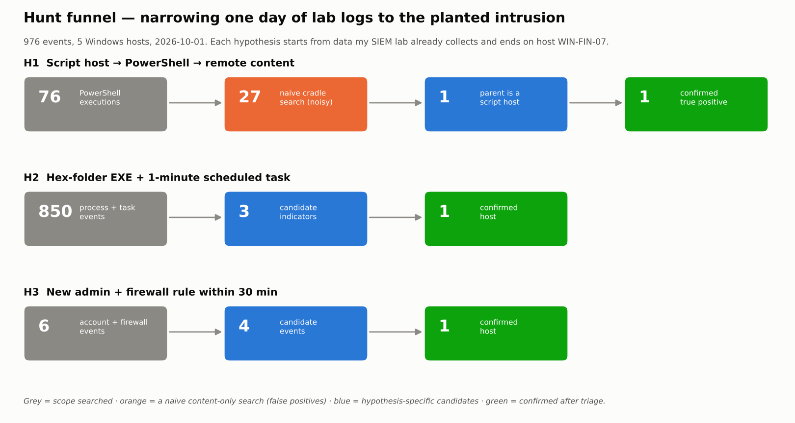

# Week 5 — Threat Hunting Concept · Assignment 3

**Lifecycle stage:** Proactive detection\
**Syllabus tasks:** (1) build a hypothesis-driven hunting scenario (e.g. suspicious PowerShell activity) · (2) execute hunt queries in Splunk or ELK · lecture sources: hunting models (intel-driven, hypothesis-driven), SANS Threat Hunting Summit, *Practical Threat Hunting* · reading: Microsoft Threat Hunting guidance, Costa-Gazcón *Data-Driven Threat Hunting*

**What this week does:** turns the Week 4 kill-chain gap analysis into three hypothesis-driven hunts for Amadey, writes them as real Kibana queries (ES\|QL / EQL / KQL), and **proves** they find a planted Amadey→StealC intrusion inside a day of benign Windows logs while rejecting benign near-misses. Built on data sources my Elastic SIEM lab already collects.

## Deliverables

| File | Content |
|---|---|
| [`01-hunting-concept.md`](01-hunting-concept.md) | What hunting is; intel-driven vs hypothesis-driven; Pyramid of Pain, HMM, Hunting Loop, **PEAK**; the ABLE test; Splunk vs ELK |
| [`02-hunt-plan.md`](02-hunt-plan.md) | **Task 1** — 3 hypotheses in PEAK/Prepare form: hypothesis, ATT&CK, data, scope, queries, triage, success criteria |
| [`03-hunt-execution.md`](03-hunt-execution.md) | **Task 2** — the queries run, funnel numbers, the hits, triage proof, self-checks, reconstructed timeline |
| [`04-findings-and-detections.md`](04-findings-and-detections.md) | Findings, 2 new detections + 2 validated, metrics, limitations, real-lab plan, feed-forward |
| [`queries/`](queries/) | 7 Kibana queries (ES\|QL / EQL / KQL) + how-to, index `logs-*` |
| [`data/dataset.ndjson`](data/dataset.ndjson) | 976-event synthetic ECS dataset (benign noise + 1 planted intrusion + near-misses) |
| [`data/hunt_results.json`](data/hunt_results.json) | Machine-readable hunt output (funnel counts, confirmed hits, self-checks) |
| [`scripts/`](scripts/) | `gen_dataset.py` (build data), `run_hunt.py` (execute + self-check), `make_figures.py` |
| [`figures/`](figures/) | `hunt_funnel.png`, `incident_timeline.png` |

## The three hypotheses

| | Hypothesis | Kill-chain phase | ATT&CK v19 | Lab data |
|---|---|---|---|---|
| **H1** | A script host spawned PowerShell that pulled/ran remote content | 4 Exploitation | T1059.001/.007, T1218.005, T1105 | 4688 + 4104 |
| **H2** | A hex-named EXE in a user folder got a 1-minute scheduled task | 5 Installation | T1053.005, T1204.002 | 4688 + 4698 |
| **H3** | A new local admin + a firewall rule on one host within minutes | 7 Actions on Objectives | T1136.001, T1021.001, T1686 | 4720/4732 + 4946 |

H1 is the syllabus's own example ("suspicious PowerShell activity"), reached by analysis in Week 4 — not picked at random.

## Results in numbers

| Metric | Value |
|---|---|
| Events hunted | **976** across 5 hosts (2026-10-01) |
| Hypotheses confirmed on the planted intrusion | **3 / 3** |
| False positives after triage | **0** (3 near-misses rejected) |
| H1 specificity | naive content search **27** → behavioural hunt **1**, no false negatives |
| New detections produced | **2** (H1 rule, H3 correlation rule) |
| Week-3 Sigma rules validated | **2** (hex-folder EXE, 1-minute task) |
| Self-checks | **6 / 6 PASS** (`run_hunt.py` exit 0) |



## How to reproduce

```bash
cd week-05-threat-hunting/scripts
python gen_dataset.py     # -> ../data/dataset.ndjson   (deterministic, 976 events)
python run_hunt.py        # executes the 3 hunts + self-checks -> ../data/hunt_results.json
pip install matplotlib && python make_figures.py
```

In the real lab, load `data/dataset.ndjson` into Elasticsearch (or point at `logs-*`) and run the [`queries/`](queries/) in Kibana — see [`04-findings-and-detections.md`](04-findings-and-detections.md) §4.5.

---

## Defense notes (7–8 min) — Assignment 3

| Time | Point | Show |
|---|---|---|
| 0:00–1:00 | Hunting ≠ alerting; proactive, hypothesis-led; a hunt that finds nothing still closes a gap | `01`, §1.1 |
| 1:00–2:00 | Intel-driven (Weeks 2–3, IOCs) vs hypothesis-driven (this week, TTPs) + Pyramid of Pain | `01`, §1.2 |
| 2:00–3:00 | The 3 hypotheses come from the Week 4 gaps; PEAK structure; the ABLE test | `02` |
| 3:00–5:30 | Run the hunts: H1 funnel 76→27→1, H2 three indicators align, H3 EQL correlation; triage out the near-misses | `03`, funnel figure, queries |
| 5:30–6:30 | One intrusion found three ways → reconstructed timeline; break it earliest at H1 | `incident_timeline.png` |
| 6:30–7:30 | Act with Knowledge: 2 new rules + 2 validated, back into the Week-3 Sigma pipeline; real-lab next step | `04` |

**Likely questions**

- *Intel-driven vs hypothesis-driven?* — Intel-driven starts from IOCs (hashes, IPs) — easy and fast but short-lived. Hypothesis-driven starts from a behaviour (TTP) — harder to build, but catches the next build whose hash I don't have. I use both; this week is the second.
- *Why is the data synthetic?* — The lab collects the right logs but has no Amadey in it yet (that's Week 9). The dataset is built from documented Amadey behaviour using the exact ECS fields Elastic produces, so the **queries are real**; only the data is simulated. The plan to run it on real telemetry is in `04` §4.5.
- *Why ES\|QL and EQL both?* — ES\|QL for filter/shape/aggregate (the hunt + triage); EQL for ordered correlation (the H1 chain, the H3 account+firewall sequence). KQL for quick pivots.
- *How did you avoid false positives?* — Each hypothesis adds a behavioural condition that benign activity fails: parent=script host (H1), user-writable path + `PT1M` (H2), account-to-Administrators **and** a firewall rule within 30 min (H3). The three planted near-misses are all rejected.
- *What's the deliverable of a hunt?* — Not just "found it": 2 new detections, 2 validated rules, and documented gaps — fed back into the Week-3 pipeline. That's the hunting loop (HMM: run known hunts → automate the wins).
- *Splunk or ELK?* — Lab is Elastic, so queries are ES\|QL/EQL/KQL. The Splunk SPL equivalent is in `queries/README.md`; same logic, different syntax.
