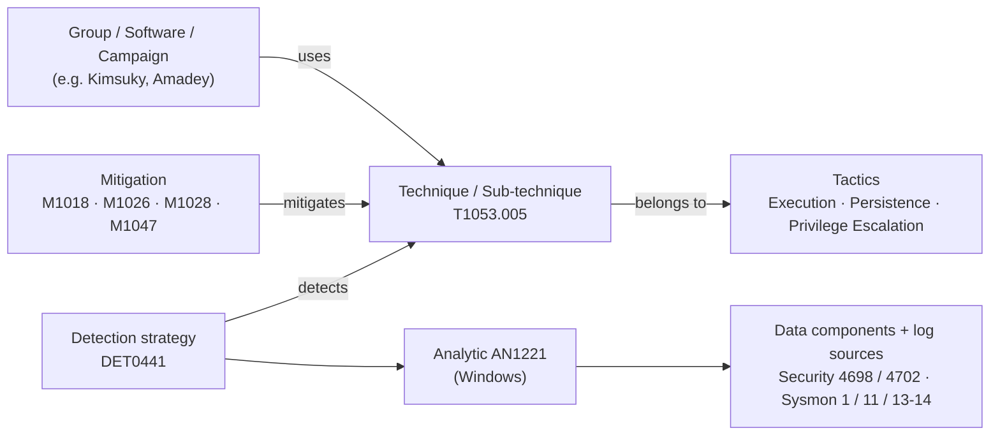

# 1. MITRE ATT&CK — tactics, techniques, procedures (and the Navigator)

> **Syllabus (Week 6):** *ATT&CK Framework — Tactics, Techniques, Procedures* · source: attack.mitre.org · reading: *MITRE ATT&CK Navigator documentation*.
> All numbers below come from the official **Enterprise ATT&CK v19.2** STIX bundle (read by [`scripts/build_attack_profile.py`](scripts/build_attack_profile.py)), counting only objects that are neither revoked nor deprecated.

## 1.1 What ATT&CK is

ATT&CK is a **knowledge base of adversary behaviour built from real-world observations** — every technique needs public reporting of real use. Unlike the Kill Chain (Week 4), it is not a sequence; it is a **matrix** of *why* (tactics) × *how* (techniques), plus the evidence of *who* did it (procedures).

| Enterprise ATT&CK v19.2 | Count |
|---|---|
| Tactics | **15** (v19 split *Defense Evasion* into **Stealth** TA0005 and **Defense Impairment** TA0112) |
| Techniques / sub-techniques | **222** / **475** |
| Groups · campaigns | 176 · 56 |
| Software (malware + tools) | 825 (730 + 95) |
| Mitigations | 44 |
| Detection strategies · analytics · data components | 697 · 1,758 · 106 |

## 1.2 The TTP hierarchy — on the technique I study this week

| Level | Question | Example (this week) |
|---|---|---|
| **Tactic** | *Why* — the adversary's goal | Persistence (TA0003) — also Execution and Privilege Escalation |
| **Technique** | *How*, in general | T1053 Scheduled Task/Job |
| **Sub-technique** | *How*, more specifically | T1053.005 Scheduled Task (Windows Task Scheduler) |
| **Procedure** | *Exactly how* one actor did it | Amadey v3/v4: a task named after its EXE that re-runs it **every minute**; Amadey v5: the same task created through the Task Scheduler COM API instead of `schtasks.exe` |

One technique can serve several tactics: T1053.005 is listed under Execution, Persistence **and** Privilege Escalation, because the same task can run code now, run it again after reboot, or run it as a more privileged account.

## 1.3 The object model (how the pieces connect)

**Change worth knowing (v18 → v19):** the old *data sources* are gone (0 active objects in v19.2). Detection is now modelled as **detection strategy → analytic → data component + concrete log source/channel** (e.g. `WinEventLog:Security EventCode=4698`). That maps straight onto SIEM work: an analytic tells me *which event IDs to collect* and *which fields are tunable* for my environment.

## 1.4 The syllabus example: T1059 (formerly "Command-Line Interface")

The syllabus names **T1059 – Command-Line Interface**. That was the technique's name before ATT&CK v7 (2020) introduced sub-techniques; today the same ID is **T1059 Command and Scripting Interpreter**, and older stand-alone techniques were folded into it — e.g. **T1086 PowerShell was revoked into T1059.001** (confirmed by the `revoked-by` relationship in the v19.2 bundle).

| Sub-technique | Platform | Used in this project's Amadey chain |
|---|---|---|
| **T1059.001 PowerShell** | Windows | Emmenhtal PowerShell stages (Week 4), v5 command 0x0E, `Expand-Archive` for StealC; **Method B of this week's lab exercise** |
| T1059.002 AppleScript | macOS | — |
| **T1059.003 Windows Command Shell** | Windows | v5 commands 0x0C / 0x1C; **the action of this week's lab task** (`cmd.exe /c …`) |
| T1059.004 Unix Shell | Linux, macOS, ESXi, network devices | — |
| T1059.005 Visual Basic | Windows, macOS, Linux | — |
| T1059.006 Python | Windows, macOS, Linux, ESXi | Talos `checkbalance.py` (Week 2 data) |
| **T1059.007 JavaScript** | Windows, macOS, Linux | Emmenhtal JavaScript downloader (Week 4) |
| T1059.008 Network Device CLI | network devices | — |
| T1059.009 Cloud API | cloud / SaaS | — |
| T1059.010 AutoHotKey & AutoIT | Windows | — |
| T1059.011 Lua | Windows, Linux, macOS, network devices | — |
| T1059.012 Hypervisor CLI | ESXi | — |
| T1059.013 Container CLI/API | containers | — |

**Why I still study T1053.005 instead:** T1059 is the "glue" of almost every intrusion and is very broad (13 sub-techniques). T1053.005 is narrow, it is Amadey's **core persistence**, it is the technique behind my Week 3 Sigma rule and Week 5 hunt H2 — and, as the deep-dive shows, **ATT&CK does not list Amadey for it yet**. T1059 still appears this week: the lab exercise exercises T1059.001 and T1059.003, so both techniques end up mapped.

## 1.5 ATT&CK Navigator (recommended reading)

The [ATT&CK Navigator](https://mitre-attack.github.io/attack-navigator/) is a web app that draws the matrix and lets me annotate it. Everything is stored in a **layer** — a small JSON file:

| Layer field | Meaning | Used here |
|---|---|---|
| `versions` / `domain` | ATT&CK version + matrix (`enterprise-attack`) | ATT&CK 19, layer format 4.5 |
| `techniques[]` | per technique (and per tactic): `score`, `color`, `comment`, `metadata`, `enabled` | score = expected / observed visibility |
| `gradient` + `legendItems` | turn scores into colours, explain them | white → amber → green |
| `filters.platforms` | hide other platforms | Windows only |

Useful features from the documentation: **open a layer by URL** (`#layerURL=…`) or upload it; **multi-select** by tactic or by group/software; **create a layer from other layers** with a score expression (e.g. `b - a` to see what changed between an *expected* and an *observed* coverage layer); **export** to SVG/Excel for reports.

How the project uses layers:

| Week | Layer | Shows |
|---|---|---|
| 4 | `amadey_kill_chain_layer.json` · `amadey_detection_coverage_layer.json` | Amadey techniques by kill-chain phase · by lab coverage |
| **6** | [`navigator/t1053_005_lab_exercise_layer.json`](navigator/t1053_005_lab_exercise_layer.json) | techniques the lab exercise touches, scored by **expected** visibility |
| **6** | `navigator/t1053_005_observed_layer.json` (written by `map_results.py` after the lab run) | the same techniques scored by what the SIEM **actually** recorded and detected |

Comparing the two Week 6 layers (`observed − expected`) is the Navigator way of answering "did my lab see what I thought it would?".

### Sources
- MITRE ATT&CK Enterprise v19 — https://attack.mitre.org/ · STIX data: https://github.com/mitre-attack/attack-stix-data
- T1059 — https://attack.mitre.org/techniques/T1059/ · T1053.005 — https://attack.mitre.org/techniques/T1053/005/
- ATT&CK Navigator — https://mitre-attack.github.io/attack-navigator/ · documentation and layer format: https://github.com/mitre-attack/attack-navigator
