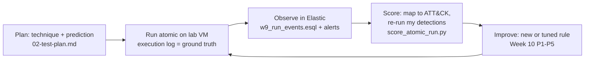

# 1. Atomic Red Team — what it is and where it fits

> **Syllabus (Week 9, Assignment 5):** *run selected atomic tests (e.g. T1059, T1003), then record and analyse the results in a SIEM.* Reading: Atomic Red Team wiki / GitHub.
> This week's split: **I run the atomic tests myself on the lab VM.** The repository holds the plan, the predictions and the SIEM-side analysis: export queries, ATT&CK mapping, scoring of my detections from Weeks 3, 5 and 7, and the Navigator layers.

## 1.1 The library

**Atomic Red Team** (Red Canary, open source since 2017) is a library of small tests called *atomics*. Each atomic reproduces **one ATT&CK technique** in a few commands, so a defender can check: *if this technique happens on my endpoint, what does my SIEM record, and does any detection fire?*

| Part | What it is |
|---|---|
| `atomics/T<id>/T<id>.yaml` | one file per technique with one or more tests |
| a test | `name`, `auto_generated_guid`, `description`, `supported_platforms`, `input_arguments`, `dependencies` (prerequisites), `executor` (`command_prompt`, `powershell`, `sh`, `bash`, `manual`) with `command` and `cleanup_command`, `elevation_required` |
| **Invoke-AtomicRedTeam** | PowerShell module that lists, checks prerequisites for, runs and cleans up atomics, and writes every run to an **execution log** (CSV). This log is my ground truth in [`03`](03-siem-analysis.md) §3.3. |
| Coverage | hundreds of techniques; the number of tests per technique varies a lot (some have one, some a dozen) |

**Why "atomic":** one technique, no chain, no command-and-control. That makes a result easy to read: if nothing reached the SIEM, the gap belongs to that one technique. The cost is that an atomic shows **a** procedure for the technique, not necessarily **Amadey's** procedure ([`02`](02-test-plan.md) §2.4, prediction P7).

## 1.2 Atomics vs emulation vs evaluations

| | Atomic Red Team | Adversary emulation plan (Week 8) / MITRE CALDERA | MITRE ATT&CK Evaluations |
|---|---|---|---|
| Unit | one technique, one test | a chain of techniques telling one actor's story | a full emulated intrusion against a vendor product |
| Question it answers | "Do I see / detect *this technique*?" | "Would I catch *this adversary end to end*?" | "How does product X do against actor Y?" |
| Automation | Invoke-AtomicTest per test | CALDERA *abilities* chained into *operations* by an agent | vendor-run, public results |
| What I take from it | the tests (Week 9) | the story (Week 4 kill chain) | the **detection categories**: None / Telemetry / General / Tactic / Technique ([`03`](03-siem-analysis.md) §3.8) |

The three fit together in a purple-team loop. The emulation plan chooses *which* techniques matter. Atomics test them one by one. The scoring vocabulary comes from the Evaluations.

## 1.3 The validation loop this week runs

The **prediction** is written *before* the run ([`02`](02-test-plan.md)). Without it a test only describes what happened. With it, the test confirms or rejects what I believed about my lab. Week 6 used the same pattern (P1–P5).

## 1.4 Safety rules for my lab

| Rule | Why |
|---|---|
| Isolated Windows VM only (the one that ships logs to my Elastic), **snapshot before the run**, revert after | atomics change real system state |
| Host-only / internal network; atomics that download go to a **lab-local web server** | no traffic to the internet; tests that need the internet are adapted or skipped |
| Read each test's YAML (`-ShowDetails`) and run the prerequisite check before running it | know exactly what will execute |
| Prefer tests that use built-in Windows tools; Tier A/B tests use **no third-party binaries** | nothing foreign is brought onto the VM |
| **Defender stays on** | a Defender block is a result (AV flag), not a failure |
| Skip tests that disable logging or security tools | they would blind the very SIEM I'm measuring; Week 10 P1 will get its own test after the rule exists |
| One test at a time, ≥ 2 minutes apart; run the cleanup command after the export | keeps each test in its own time window; leaves the VM clean |
| Never on the host machine or any non-lab system | |

## Sources

- Red Canary, Atomic Red Team — <https://github.com/redcanaryco/atomic-red-team> (wiki: <https://github.com/redcanaryco/atomic-red-team/wiki>)
- Red Canary, Invoke-AtomicRedTeam — <https://github.com/redcanaryco/invoke-atomicredteam> (wiki: execution logging, prerequisites, cleanup)
- MITRE CALDERA — <https://caldera.mitre.org/> · MITRE ATT&CK Evaluations (detection categories None / Telemetry / General / Tactic / Technique)
- Elastic, ES|QL reference — <https://www.elastic.co/docs/reference/query-languages/esql>
