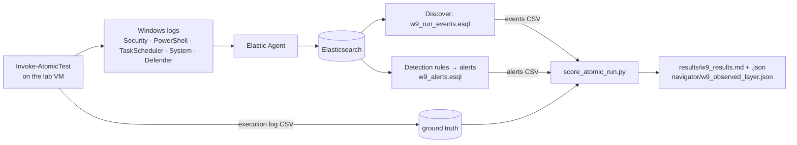

# 3. Recording and analysing the results in the SIEM

> **Syllabus task, second half:** *record and analyse the results in a SIEM.*
> Queries: [`queries/w9_run_events.esql`](queries/w9_run_events.esql), [`queries/w9_alerts.esql`](queries/w9_alerts.esql) · scorer: [`scripts/score_atomic_run.py`](scripts/score_atomic_run.py) · run sheet: [`templates/w9_run_sheet.csv`](templates/w9_run_sheet.csv).

## 3.1 Data flow



## 3.2 Before the run — checklist

| Check | How | Needed for |
|---|---|---|
| Process creation **with command line** (4688) | already on (Week 2) | almost every test |
| PowerShell Script Block Logging (4104) | already on (Week 2) | A1, A3, A4, B1–B4 |
| *Audit Other Object Access Events* → 4698/4702 | Week 6 §3.4 | A3 |
| TaskScheduler/Operational enabled and collected | Week 6 §3.4 | A3 |
| *User Account Management* + *Security Group Management* → 4720/4732 | default on Windows Server | A5 |
| *MPSSVC Rule-Level Policy Change* → 4946 | used by Week 5 H3 | A6 |
| Defender/Operational collected (1116/1117) | Custom Windows Event Log integration (Week 2) | C2, AV flag |
| The two Week 7 Kibana rules imported and **enabled** | `week-07-mitre-car/rules/car_2021_12_001_tuned.ndjson` | alerts input, P9 |
| VM clock in sync (NTP), time zone known | `w32tm /query /status` | windows depend on time; the execution log writes UTC |

## 3.3 Ground truth: what was run, when, by which process

Invoke-AtomicTest writes every execution to a CSV log (default `%TEMP%\Invoke-AtomicTest-ExecutionLog.csv`; see `-ExecutionLogPath`). The scorer reads these columns of the default logger: `Execution Time (UTC)`, `Technique`, `Test Number`, `Test Name`, `Hostname`, `GUID`, `ProcessId`, `ExitCode`.

- **`ProcessId`** is the PID of the executor process (`powershell.exe` / `cmd.exe`) that ran the test commands. It lets the scorer follow the **process tree** instead of trusting the time window alone.
- If your module version writes other column names or another time format, use the run sheet instead ([`templates/w9_run_sheet.csv`](templates/w9_run_sheet.csv): `technique`, `utc_start` in ISO UTC, optional `utc_end`, `pid`, `guid`). Rows with `phase` = `cleanup` are skipped.

## 3.4 Export

1. **Events**: Discover → ES|QL → [`w9_run_events.esql`](queries/w9_run_events.esql), time picker from 1 min before the first test to 5 min after the last, host name replaced → *Download → CSV*.
2. **Alerts** (optional): [`w9_alerts.esql`](queries/w9_alerts.esql) with the end time extended by 10 min → CSV.
3. Score:

```bash
cd week-09-atomic-red-team/scripts
python build_test_plan.py                     # once: the plan + ATT&CK tactics the scorer uses
python score_atomic_run.py --runlog Invoke-AtomicTest-ExecutionLog.csv --events w9_events.csv --alerts w9_alerts.csv
# -> results/w9_results.md, results/w9_results.json, navigator/w9_observed_layer.json
```

## 3.5 Tying events to tests (attribution)

| Step | Rule | Why |
|---|---|---|
| 1 Time window | `[start − 5 s, min(start + 3 min, next test start))` on the same host; `--window` changes the 3 min | the purple-team join of red notes and blue logs (Week 6) |
| 2 Process tree | with a `ProcessId`, a process event counts only if it **descends** from the executor; 4104 / Sysmon events by their `process.pid` | background processes in the same minutes (Windows Update, Defender scans) don't pollute the result |
| 3 Service-side events | 4698/4702, 4720/4732, 4946, 1102, 4719, 7045, Defender 1116/1117 are joined by window: the service writes them, not the test's process | they never carry the test's PID |
| 4 Task runs | TaskScheduler 100/102/129/200/201 only for a **task name created in the same test** | Windows runs its own tasks every few minutes |
| 5 Noise | Invoke-AtomicTest's own script blocks and the Elastic Agent processes are dropped | they are the framework, not the technique |
| 6 Executor | the executor's own 4688 counts as evidence **only if its command line shows the tested technique** (e.g. an encoded PowerShell test) | every test starts one; otherwise every test would "see" T1059.001 |

Without a `ProcessId` the scorer falls back to the window alone and says so (`attribution: time window only`).

## 3.6 Mapping events to ATT&CK

| Event | Technique(s) |
|---|---|
| 4688 `powershell.exe` (+ download keyword) / 4104 script block | T1059.001 (+ T1105) |
| 4688 `cmd.exe` · `wscript`/`cscript` with `.js` · with `.vbs` | T1059.003 · T1059.007 · T1059.005 |
| 4688 `mshta.exe` · `rundll32.exe` · `regsvr32.exe` | T1218.005 · T1218.011 · T1218.010 |
| 4688 `schtasks /create\|/change`; 4698; 4702; TaskScheduler 106/140/100/200/201; interpreter started by the Task Scheduler service | T1053.005 |
| 4104 with `Register-ScheduledTask` · `New-LocalUser` · `New-NetFirewallRule` · `…\CurrentVersion\Run` | T1053.005 · T1136.001 · T1686 · T1547.001 |
| 4688 `reg.exe save hklm\sam\|system\|security` · `reg add …\Run` · `fDenyTSConnections` · other `reg add` | T1003.002 · T1547.001 · T1112 + T1021.001 · T1112 |
| 4688 `net user … /add`; 4720 · `net localgroup … /add`; 4732 | T1136.001 · T1098.007 |
| 4688 `netsh … firewall add\|set`; 4946/4947 | T1686 |
| 4688 `certutil` with URL · `bitsadmin` · `curl` with URL | T1105 (+ T1197 for BITS) |
| 4688 `systeminfo`/`hostname` · `ipconfig`/`route`/`arp` · `whoami` · `tasklist` · `net user`/`net group` | T1082 · T1016 · T1033 · T1057 · T1087 / T1069 |
| 4688 command line with `lsass` + a dump keyword | T1003.001 |
| 1102 · 4719 · 7045 | T1685.005 · T1685.001 · T1543.003 |
| Sysmon (when installed) 1 = 4688 · 13 Run key / `fDenyTSConnections` · 10 access to `lsass.exe` | as 4688 · T1547.001 / T1112 + T1021.001 · T1003.001 |
| Defender 1116/1117 | no technique: AV flag |

`tested technique observed` in the results says whether the technique declared in the execution log was found in the mapped telemetry. This checks both the test and my mapping.

## 3.7 Detections scored

Re-implemented in the scorer with the same logic as the originals (Week 7's tuned CAR logic is **imported** from `week-07-mitre-car/scripts/evaluate_car.py`, so it cannot drift):

| ID | Detection | Maps to |
|---|---|---|
| W3-SCHTASKS | Week 3 Sigma: `schtasks /Create /SC MINUTE /MO 1 /TR` + user folder | T1053.005 |
| W3-HEXEXE | Week 3 Sigma: EXE from a 10-hex-character folder | T1204.002 |
| W3-RUNDLL32 | Week 3 Sigma: rundll32 + `cred(64).dll` / `clip(64).dll` | T1218.011, T1555.003, T1115 |
| W5-H1a / W5-H1b | Week 5 H1: script host → PowerShell / 4104 download cradle | T1059.001, T1059.007, T1218.005 / T1059.001, T1105 |
| W5-H2b / W5-H2c | Week 5 H2: schtasks every minute / 4698 with `PT1M` | T1053.005 |
| W5-H3 / W5-H3-confirmed | Week 5 H3: new account or Administrators member / + firewall rule within 30 min | T1136.001 / + T1686, T1021.001 |
| W7-CAR-PROC / W7-CAR-TASK | Week 7 tuned CAR-2021-12-001, process / Task Scheduler branch | T1053.005 |
| AV-DEFENDER | Defender 1116/1117 in the SIEM (antivirus, not my rule) | — |

**Kibana alerts** (optional input) are joined to a test by `kibana.alert.original_time` (when the event happened). `@timestamp` (when the rule created the alert) − test start gives **time to alert**, including the rule's 5-minute schedule. Known rule names are mapped back to the IDs above, so a rule that fires in the scorer but not in Kibana is visible at once. That points at a deployment problem (rule off, index pattern, field mapping), not at the logic.

## 3.8 Scoring

Categories adapted from **MITRE ATT&CK Evaluations**:

| Result | Meaning |
|---|---|
| **None** | nothing shows that the test reached the SIEM (the executor's own start does not count) |
| **Telemetry** | events are there, no detection fired |
| **General** | a detection fired that names no technique or an unrelated one (e.g. a Defender alert) |
| **Tactic** | a detection fired that maps to the same **tactic** |
| **Technique** | a detection fired that maps to the tested **technique** (or its parent/sub-technique) |

Flags: **AV** (Defender 1116/1117 in the window), **FAILED** (exit code ≠ 0, i.e. the test may not have done everything).

Metrics in `results/w9_results.md`: visibility rate, technique-level and any-level detection rate, tested-technique-observed count, median time to detection (event) and to Kibana alert, failed / AV-flagged tests, background events and alerts outside any test (noise), and **predictions as / better / worse** than [`02`](02-test-plan.md).

## 3.9 What to keep for the defense (`evidence/`)

1. The execution log (or filled run sheet) and the two CSV exports.
2. Kibana Discover with the ES|QL result of one test (e.g. W9-A3: 4688 `schtasks` + 4698 with `PT1M`).
3. Kibana Alerts with the Week 7 rule firing on W9-A3 and the H3 correlation on W9-A6.
4. `results/w9_results.md` and the observed layer next to the predicted layer in the Navigator.

## 3.10 Self-test

`python score_atomic_run.py --selftest` runs the scorer on built-in sample events shaped like the expected telemetry (no files written). It has **12 checks**: execution-log parsing incl. a US time format, Technique for a scheduled task (Week 3 + Week 5 + both Week 7 branches), process-tree attribution that ignores an unrelated process and an unrelated task run, framework script blocks dropped, H3 single and correlated, nominal rundll32 coverage, a Defender-blocked test (General + AV + FAILED), a None case, the executor rule, a Kibana alert joined by original time (270 s), and the prediction check. **12/12 PASS.**
