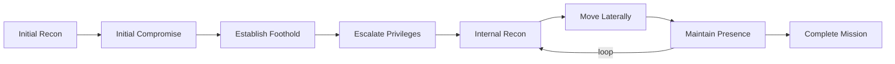

# 1. APTs — what the term means, what the readings add, how groups are named

> **Syllabus (Week 10):** *Analyse the TTPs used by APT29 or APT41 and map them to MITRE ATT&CK.* Readings: Mandiant *APT1: Exposing One of China's Cyber Espionage Units* (Feb 2013) · CrowdStrike *Global Threat Report* (2026 edition, published 24 Feb 2026).
> This file sets up the vocabulary; [`02`](02-apt29-mapping.md) and [`03`](03-apt41-mapping.md) map the two groups, [`04`](04-comparison-and-priorities.md) compares them with Amadey and turns the result into detection priorities.

## 1.1 Advanced, Persistent, Threat

| Word | Meaning | Example from this week |
|---|---|---|
| **Advanced** | The operator can build or buy what the target needs: custom malware, zero-days, supply-chain access. Advanced does **not** mean they always use custom tools. They pick the cheapest tool that works. | APT29 trojanised the SolarWinds Orion build, yet its ATT&CK software list also includes Mimikatz, AdFind, Cobalt Strike and Impacket |
| **Persistent** | The goal is long-term. The operator stays, comes back after clean-up, and works through the network slowly. | APT1: on average **356 days** inside a victim, longest **1,764 days** (Mandiant 2013) |
| **Threat** | People with a mission, a budget and tasking, usually a state or state-sponsored. They are not automated malware. | APT29 → Russia's SVR; APT41 → Chinese state-sponsored, also financially motivated |

**APT vs commodity crimeware (my Amadey project).** Amadey is a malware-as-a-service loader sold to anyone (Week 1). Still, ATT&CK lists two *groups* as Amadey users: **TA505**, a financially motivated actor, and **Kimsuky**, a North Korean state actor. APT41 also mixes espionage with ransomware and crypto-mining. The line between "APT" and "crimeware" is **who is behind it and why**. The techniques are often the same, which [`04`](04-comparison-and-priorities.md) measures.

## 1.2 Reading 1 — Mandiant *APT1* (February 2013)

APT1 was the first public report to tie a state cyber-espionage group to a **specific military unit**: the PLA General Staff Department's 3rd Department, 2nd Bureau, **Unit 61398** in Shanghai. Before it, vendors said "the Chinese government may authorize this activity" and stopped there.

| Key finding | Number |
|---|---|
| Victim organisations since 2006 | **141**, in **20** major industries; 87 % headquartered in English-speaking countries |
| Average / longest time inside a victim | **356 days** / **1,764 days** (4 years 10 months) |
| Largest theft from one organisation | **6.5 TB** of compressed data over 10 months |
| Infrastructure seen in two years | **937** C2 servers on **849** IP addresses in **13** countries; **2,551** FQDNs |
| Indicators released | **3,000+** (domains, IPs, MD5s), 40+ malware families, 13 X.509 certificates |

**What the report changed for threat hunting:**

1. **Attribution with evidence.** Infrastructure, operator personas ("UglyGorilla", "DOTA", "SuperHard") and keyboard-layout data were published. This shows that attribution is an **analytic judgement** built from many weak signals, not one IOC.
2. **IOCs at scale.** Releasing 3,000+ indicators showed the community what indicator sharing looks like. It also showed the limit of indicators: they sit at the bottom of the Pyramid of Pain (Week 1).
3. **Mandiant's Attack Lifecycle.** This is an APT-specific alternative to the Kill Chain I used in Week 4:

| Mandiant Attack Lifecycle | Lockheed Martin Kill Chain (Week 4) | ATT&CK v19 tactics |
|---|---|---|
| Initial Recon | 1 Reconnaissance (+ 2 Weaponization) | Reconnaissance, Resource Development |
| Initial Compromise | 3 Delivery · 4 Exploitation | Initial Access, Execution |
| Establish Foothold | 5 Installation · 6 C2 | Persistence, Command and Control |
| Escalate Privileges | inside 7 Actions on Objectives | Privilege Escalation, Credential Access |
| Internal Recon | inside 7 | Discovery |
| Move Laterally | inside 7 | Lateral Movement |
| Maintain Presence | 5 again | Persistence, Stealth, Defense Impairment |
| Complete Mission | 7 Actions on Objectives | Collection, Exfiltration, Impact |

The important difference is the **loop**: internal recon → move laterally → maintain presence → repeat. The Kill Chain is a straight line and fits Amadey well, because a loader runs one pass and hands over to StealC. It hides almost everything an APT does after the foothold. This is why this week's mapping uses ATT&CK tactics (they cover the loop) and the Mandiant stages only to tell the story.

ATT&CK has APT1 too (**G0006**, 23 techniques). I use it in [`04`](04-comparison-and-priorities.md) as a 2013 reference point: which of its techniques do APT29 and APT41 still use?

## 1.3 Reading 2 — CrowdStrike *2026 Global Threat Report* (24 February 2026)

Figures from CrowdStrike's press release for the report (covering 2025):

| Finding | Number | Why it matters for this week |
|---|---|---|
| Average eCrime **breakout time** (initial access → lateral movement) | **29 min**; fastest **27 s**; 65 % faster than 2024 | Detection must fire at Initial Access / Execution and be automated. A daily hunt is too late. |
| Data exfiltration started | within **4 min** of access in one intrusion | Phase-7 detections (Amadey's StealC) leave almost no time |
| Named adversaries tracked | **280+** | ATT&CK v19.2 has 176 active groups. No SOC can model them all, so overlap analysis ([`04`](04-comparison-and-priorities.md)) is used to prioritise |
| AI-enabled adversary operations | **+89 %** year on year | |
| **China-nexus** activity | **+38 %**; 67 % of the vulnerabilities China-nexus actors exploited gave immediate system access; 40 % targeted internet-facing edge devices | APT41's profile: T1190 exploits of Citrix, Zoho, VPNs ([`03`](03-apt41-mapping.md)) |
| State-nexus actors targeting **cloud** | **+266 %**; cloud-conscious intrusions +37 % | APT29's profile: Entra ID / M365 tokens, SAML, service principals ([`02`](02-apt29-mapping.md)) |
| **DPRK**-linked incidents | **+130 %** | Kimsuky (an Amadey user) belongs to this cluster |
| Vulnerabilities exploited **before public disclosure** | **42 %** | Patch-based defence alone is not enough; behaviour detection is needed |

## 1.4 One group, many names

Every vendor names groups its own way, so one actor gets many names. ATT&CK collects them as *associated groups*:

| ATT&CK | Aliases recorded in ATT&CK v19.2 | Naming scheme behind some of them |
|---|---|---|
| **APT29** (G0016) | IRON RITUAL, IRON HEMLOCK, NobleBaron, Dark Halo, NOBELIUM, UNC2452, YTTRIUM, The Dukes, **Cozy Bear**, CozyDuke, SolarStorm, Blue Kitsune, UNC3524, **Midnight Blizzard** (15 incl. APT29) | CrowdStrike: animal = country (*BEAR* = Russia). Microsoft: weather = country (*Blizzard* = Russia). Mandiant: *APT* = attributed state actor, *UNC* = uncategorised cluster |
| **APT41** (G0096) | **Wicked Panda**, **Brass Typhoon**, BARIUM | *PANDA* = China (CrowdStrike), *Typhoon* = China (Microsoft); BARIUM was Microsoft's older element name |
| TA505 (G0092) | Hive0065, Spandex Tempest, CHIMBORAZO | *TA* = Proofpoint "threat actor"; *Tempest* = financially motivated (Microsoft) |
| Kimsuky (G0094) | Black Banshee, **Velvet Chollima**, Emerald Sleet, THALLIUM, APT43, TA427, Springtail, Earth Kumiho, PatheticSlug | *CHOLLIMA* = North Korea (CrowdStrike), *Sleet* = North Korea (Microsoft) |

**Why this matters for mapping:** an alias is a claim that two vendors' clusters overlap, not that they are identical. ATT&CK merges, for example, UNC3524 into APT29. The group's technique list is therefore the **union** of everything reported under all these names over 15+ years. I keep that in mind when reading the numbers in [`04`](04-comparison-and-priorities.md) §4.7.

## 1.5 How the mapping is done

| Step | What | Where |
|---|---|---|
| 1 | Pull every technique ATT&CK v19.2 links to the group **and** to campaigns attributed to it, with the procedure text and its source (G… or C…) | `scripts/build_apt_profiles.py` |
| 2 | Check every ID is active (v19 renamed several: T1562.001 → **T1685**, T1562.004 → **T1686**) | same script, fails on any stale ID |
| 3 | Group by tactic, read the procedures, tell each group's story along the Mandiant lifecycle | [`02`](02-apt29-mapping.md), [`03`](03-apt41-mapping.md), full tables in [`data/ttp_tables.md`](data/ttp_tables.md) |
| 4 | Compare with Amadey (Week 4), TA505, Kimsuky and APT1. Estimate what my SIEM lab can see. Lay my Week 3/5/7 detections on top. | [`04`](04-comparison-and-priorities.md), [`data/comparison.json`](data/comparison.json) |
| 5 | Navigator layers + figures for the defense | [`navigator/`](navigator/), [`figures/`](figures/) |

Software is counted **separately** and not merged. APT29 uses 49 tools; adding every technique those tools *can* do would add 131 techniques that no report ties to APT29 itself (Mimikatz alone has dozens). ATT&CK's own group pages keep them apart for the same reason.

## Sources

- Mandiant, *APT1: Exposing One of China's Cyber Espionage Units*, February 2013 — <https://services.google.com/fh/files/misc/mandiant-apt1-report.pdf>
- CrowdStrike, *2026 Global Threat Report* press release, 24 February 2026 — <https://www.crowdstrike.com/en-us/press-releases/2026-crowdstrike-global-threat-report/>
- MITRE ATT&CK v19.2 STIX data — <https://github.com/mitre-attack/attack-stix-data> · group pages: [G0016 APT29](https://attack.mitre.org/groups/G0016/), [G0096 APT41](https://attack.mitre.org/groups/G0096/), [G0092 TA505](https://attack.mitre.org/groups/G0092/), [G0094 Kimsuky](https://attack.mitre.org/groups/G0094/), [G0006 APT1](https://attack.mitre.org/groups/G0006/) · campaigns: [C0024](https://attack.mitre.org/campaigns/C0024/), [C0023](https://attack.mitre.org/campaigns/C0023/), [C0017](https://attack.mitre.org/campaigns/C0017/), [C0040](https://attack.mitre.org/campaigns/C0040/) · software: [S1025 Amadey](https://attack.mitre.org/software/S1025/)
