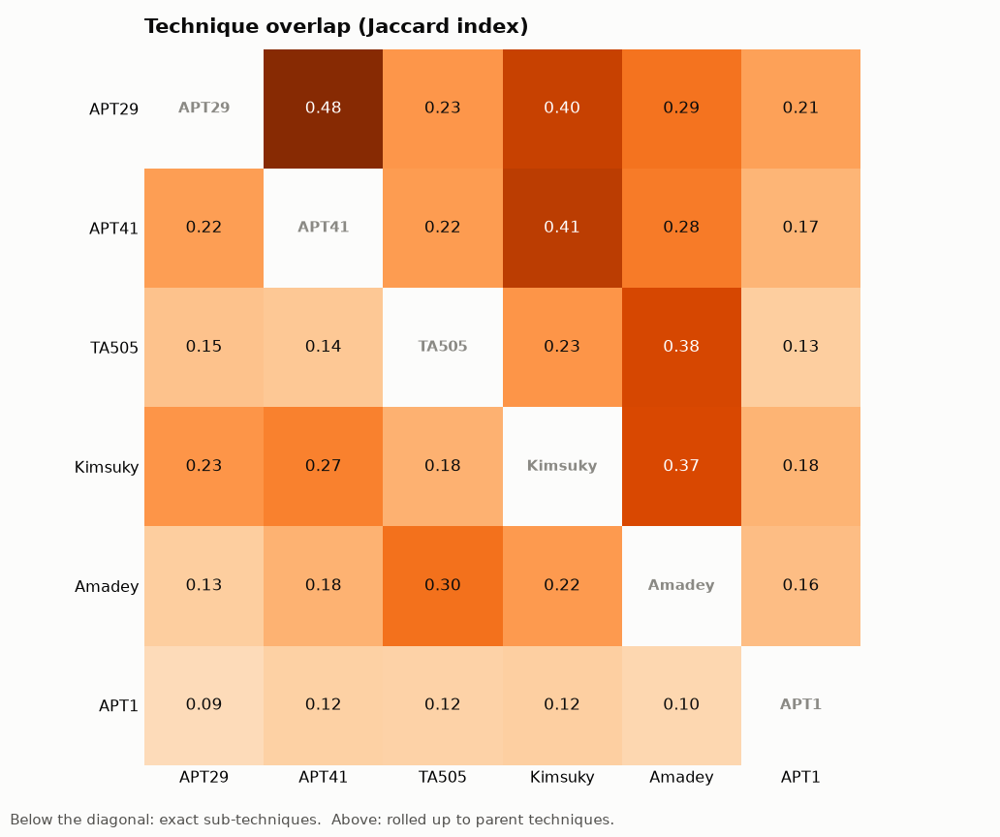
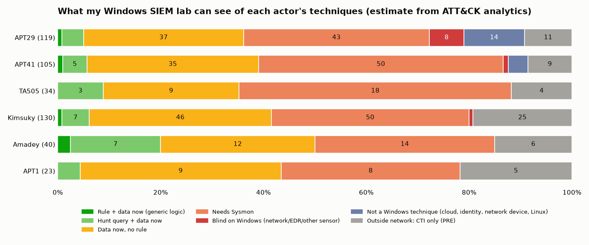

# 4. Comparison with Amadey and its users, my lab coverage, and what to build next

> Turns the two mappings into decisions: how alike are APT29, APT41, TA505, Kimsuky, APT1 and Amadey; what can my SIEM lab see of the two APTs; and which detections give the most for the least work.
> Generated by [`scripts/build_apt_profiles.py`](scripts/build_apt_profiles.py) → [`data/comparison.json`](data/comparison.json), [`data/apt_techniques.csv`](data/apt_techniques.csv), [`figures/`](figures/), [`navigator/`](navigator/).

## 4.1 Method

| Choice | Decision | Why |
|---|---|---|
| Technique set of a group | ATT&CK v19.2 *uses* links of the **group + campaigns attributed to it** | APT29's group page misses 53 techniques recorded only under the SolarWinds campaign ([`02`](02-apt29-mapping.md) §2.1) |
| Software | listed, **not merged** | Tool capabilities would add 131 (APT29) / 116 (APT41) techniques that no report ties to the group |
| Amadey | the **40 techniques of my Week 4 analysis** (ATT&CK's S1025 lists 17, all of them inside my 40) | the more complete, procedure-level view |
| Overlap | **Jaccard index** = shared ÷ union, at two levels: exact sub-technique and parent technique | sub-technique detail makes groups look more different than they are |
| Lab visibility | ATT&CK v18+ analytics: a technique is visible if **≥ 50 % of the log sources** of one of its Windows analytics are in my lab (Security 4688 with command line stands in for Sysmon 1) | automatic, so 260+ techniques can be rated the same way; bounds and a check against Week 4 in §4.5 |
| My detections | Week 3 Sigma, Week 5 hunts, Week 7 CAR rules, each tagged **generic** or **Amadey-specific** and with any missing sensor | a rule that matches `cred64.dll` maps to T1218.011 but will never see APT41's rundll32 |

**Lab status legend** (same colours and scores as the Week 4 Amadey coverage layer):

| Status | Meaning |
|---|---|
| RULE | a generic detection rule + the data, today |
| HUNT | a generic hunt query + the data, today |
| DATA | data collected today, no rule yet |
| SYSMON | visible once Sysmon is installed |
| BLIND | Windows technique, but needs a sensor I don't have (DC auditing, network, EDR) |
| OUT | not a Windows technique (cloud, identity provider, network device, Linux) |
| CTI | PRE techniques (recon, resource development): only threat intelligence sees them |

## 4.2 APT29 vs APT41

| | APT29 | APT41 |
|---|---|---|
| Techniques | 119 | 105 |
| Shared | **40** | **40** |
| Only this group | 79 | 65 |
| Jaccard (sub-technique / parent) | **0.22 / 0.49** | |
| Heaviest tactics | Persistence 18, Priv. Esc. 17, Stealth 17, **Credential Access 16** | **Stealth 21**, Persistence 13, Discovery 13, Execution 12, C2 12 |
| Where it starts | users and trust: supply chain, service providers, phishing, stolen identities | servers: public-facing web apps, VPN, edge devices |
| Signature | identity abuse (SAML, tokens, federation, cloud roles) | tool variety, packers, bootkit/rootkit, DLL side-loading, DGA/dead-drop C2 |
| Impact techniques | 0 (espionage only) | 2 (ransomware, mining: the crime side) |
| Non-Windows (OUT) | 14 | 4 |

At the parent-technique level the two are **almost half the same** (0.49): both use scheduled tasks, PowerShell, RDP, SMB shares, credential dumping, archive-and-exfiltrate. At the sub-technique level they share only a fifth. The difference is in the details: *which* credential store, *which* C2 channel. A detection written at the parent level ("someone dumped credentials") covers both. One written at the procedure level covers one.

**The 40 shared techniques**: T1003.002, T1005, T1018, T1021.001, T1021.002, T1027.002, T1036.004, T1036.005, T1037, T1047, T1053.005, T1059.001, T1059.003, T1069, T1070.004, T1071.001, T1078, T1083, T1087.002, T1105, T1133, T1140, T1190, T1195.002, T1203, T1213.003, T1218.011, T1505.003, T1546.008, T1547.001, T1553.002, T1555, T1555.003, T1560.001, T1566.001, T1586.003, T1588.002, T1595.002, T1680, T1685 (Navigator: [`navigator/apt29_vs_apt41_layer.json`](navigator/apt29_vs_apt41_layer.json)).

## 4.3 Against Amadey and the groups that use it

| Jaccard (sub-technique) | APT29 | APT41 | TA505 | Kimsuky | Amadey | APT1 |
|---|---|---|---|---|---|---|
| **Amadey** | 0.13 | 0.18 | **0.30** | **0.22** | — | 0.10 |
| Amadey (parent level) | 0.29 | 0.28 | **0.38** | **0.37** | — | 0.16 |

1. **ATT&CK's "used by" links show up in the data.** Amadey is closest to the two groups ATT&CK lists as its users: TA505 (0.30) and Kimsuky (0.22). It is furthest from APT1. The method recovers a known relationship, which is a useful sanity check.
2. **At sub-technique level APT41 is closer to Amadey than APT29 is** (22 vs 18 shared techniques; at parent level the two are level, 0.28 vs 0.29). Both run commands, add local accounts, encrypt for impact and use discovery built-ins. APT29's identity and cloud work has no counterpart in a commodity loader.
3. **12 techniques are used by APT29, APT41 *and* Amadey**: T1005, T1021.001, T1053.005, T1059.001, T1071.001, T1083, T1105, T1140, T1218.011, T1547.001, T1555.003, T1566.001.
4. **A "commodity core" of 7 techniques is used by all five current actors** (APT29, APT41, TA505, Kimsuky, Amadey):

| Technique | Lab today | My detections mapped |
|---|---|---|
| T1059.001 PowerShell | HUNT | Week 5 H1 (generic) |
| T1105 Ingress Tool Transfer | HUNT | Week 5 H1 (generic, PowerShell cradles only) |
| T1071.001 Web Protocols | SYSMON | Week 3 `index.php` rule (Amadey-specific, needs proxy logs) |
| T1140 Deobfuscate/Decode | SYSMON | — |
| T1218.011 Rundll32 | SYSMON | Week 3 plugin rule (**Amadey-specific**: `cred64.dll`/`clip64.dll`) |
| T1555.003 Credentials from Web Browsers | SYSMON | same Week 3 rule (Amadey-specific) |
| T1566.001 Spearphishing Attachment | SYSMON | — |

47 techniques are used by at least 3 of the 5 ([`data/comparison.json`](data/comparison.json) → `core_tradecraft`). **Conclusion:** state groups and a commodity loader meet on the same Windows basics. Detections for these basics pay off against APTs too, **but only if they are written generically**. Two of my three rules in that table key on Amadey's file names.

## 4.4 APT1 (2013) → APT29 / APT41 (2026)

APT1 has 23 techniques in ATT&CK. **7 of them are still used by both APT29 and APT41**: T1005, T1021.001, T1036.005, T1059.003, T1560.001, T1566.001, T1588.002. They are spearphishing attachments, RDP, `cmd.exe`, archiving with a utility, stealing local data, names that look legitimate, and public tools. These have not changed in 13 years.

What has changed:

| 2013 (APT1) | 2026 (APT29 / APT41) |
|---|---|
| no cloud, identity-provider or SaaS techniques | APT29: 14 non-Windows techniques (Entra ID, M365, OAuth apps, SAML) |
| custom backdoors, own infrastructure (937 C2 servers) | C2 through legitimate services: Twitter, GitHub, Pastebin, Google Workspace, Cloudflare, OneDrive |
| spearphishing as the main entry | + software supply chain (both), edge-device exploitation (APT41), trusted service providers (APT29) |
| 23 documented techniques | 105–119: partly more tradecraft, partly much more public reporting (§4.7) |

## 4.5 My lab against APT29 + APT41

| Status | APT29 (119) | APT41 (105) | Union (184) |
|---|---|---|---|
| RULE | 1 | 1 | 1 |
| HUNT | 5 | 5 | 7 |
| DATA | 37 | 35 | 56 |
| SYSMON | 43 | 50 | 77 |
| BLIND | 8 | 1 | 9 |
| OUT | 14 | 4 | 17 |
| CTI | 11 | 9 | 17 |
| **Visible today** (RULE + HUNT + DATA) | 43 (36 %) | 41 (39 %) | **64 (35 %)** |
| **Visible with Sysmon** | 86 (72 %) | 91 (87 %) | **141 (77 %)** |

Navigator: [`navigator/apt_lab_coverage_layer.json`](navigator/apt_lab_coverage_layer.json).

**How much the estimate depends on the 50 % bar** (Windows techniques only):

| Rule | APT29 (94 Windows techniques) | APT41 (92) |
|---|---|---|
| lenient: *any* log source of an analytic collected | 83 | 83 |
| **chosen: ≥ 50 % of one analytic's log sources** | **41** | **39** |
| strict: *all* log sources of one analytic collected | 10 | 11 |

The truth lies between 10 and 83. The 50 % bar is a judgement call, which is why this is called an **estimate** everywhere. (The 43 / 41 "visible today" above are 2 higher than 41 / 39 here, because my Week 5 H1 hunt covers T1105, T1218.005 and T1059.007, whose ATT&CK analytics would otherwise need Sysmon.)

**Check against my own Week 4 analysis.** I ran the same automatic rule on Amadey's 40 techniques and compared it with the statuses I assigned by hand in Week 4. They agree on **17 of 40**. The 23 disagreements fall into four groups:

| Group | Techniques | Reason |
|---|---|---|
| Automatic is **too optimistic** | T1082, T1016, T1033, T1083, T1518.001, T1614, T1005, T1113, T1027, T1564.001 | ATT&CK's analytics assume the **command-line** version (`systeminfo`, `whoami`, `dir`). Amadey does discovery **inside its own process through Windows API calls**, so no 4688 is ever written. |
| Automatic is **too pessimistic** | T1204.002, T1059.007, T1218.005, T1218.011, T1555.003 | ATT&CK's analytic also wants image loads / file events. My Week 4 rules only need the 4688 parent → child chain for Amadey's specific procedure. |
| Different procedure | T1021.001, T1112 | Amadey *enables* RDP through the registry (needs Sysmon 13). ATT&CK's analytic watches RDP *logons* (4624), which I collect. |
| Automatic says Sysmon is enough | T1566.001, T1106, T1140, T1071.001, T1573.001, T1486 | Sysmon would show side effects (a network connection, a new file). In Week 4 I judged that the technique itself needs a mail gateway, a proxy or EDR. |

**The main methodological finding of the week:** visibility belongs to a **procedure**, not to a technique ID. A technique-level estimate is fine for ranking 184 techniques. For any single technique that matters, check it at procedure level (Week 4) or with a test (Week 9).

**Nominal vs real coverage.** My Weeks 3/5/7 content maps to **11** of APT29's technique IDs and 11 of APT41's. Only **6** of them would really fire on those groups. The other 5 key on Amadey artefacts (`cred64.dll`, the hex install folder, `index.php`) or need a sensor I don't have yet (Sysmon 13, proxy logs). Counting by technique ID would overstate my APT coverage by almost 2×.

## 4.6 What to build next (priorities)

Ranked by: used by how many of the 5 current actors → how cheap the next step is (data already collected first). The full list is `priorities` in [`data/comparison.json`](data/comparison.json).

| # | Detection to build | Techniques | Who uses it | Data | Effort |
|---|---|---|---|---|---|
| **P1** | **Protect the telemetry**: alert on `auditpol.exe` with `/set` … `/success:disable` (4688), on Security **1102** (log cleared) and on **4719** (audit policy changed; check it is audited) | T1685.001, T1685.005 | APT29, APT41 | ✅ now | small: protects every other rule, because both APTs attack the 4688/4698 logs my detections need |
| **P2** | **Web server → shell / LOLBin**: `w3wp.exe`, `java.exe`, `tomcat*.exe`, `httpd.exe`, `php-cgi.exe` starting `cmd`, `powershell`, `certutil`, `bitsadmin` | T1190 → T1505.003 → T1105, T1059.003 | APT41, APT29 (Exchange web shells), Kimsuky | ✅ 4688 | small: extend the parent list of Week 5 H1 |
| **P3** | **Masqueraded or hijacked tasks**: 4698 for a task under `\Microsoft\Windows\` created by a non-system account; **4702** on such a task | T1036.004 + T1053.005 | APT29 (`EventCacheManager`, hijack-and-restore), APT41 (`\WDI\USOShared` …), Kimsuky | ✅ 4698/4702 | small: second branch next to the Week 7 CAR rule |
| **P4** | **Discovery burst**: ≥ 4 of `net user/group /domain`, `whoami`, `systeminfo`, `nltest`, AdFind from one parent within 5 min | T1087.002, T1069, T1033, T1082, T1018 | APT29, APT41, Kimsuky, TA505 | ✅ 4688 | medium: threshold tuning on 30 days of lab data |
| **P5** | **Password spraying**: 4625 for ≥ 10 different accounts from one source in 10 min | T1110.003, T1110 | APT29, APT41 | ✅ 4625 | small |
| **P6** | **Install Sysmon**, then turn the Amadey-specific plugin rule into a generic one: rundll32 loading a DLL from a user-writable path | T1218.011, T1555.003, T1547.001, T1574.001, T1003.001 + 72 more | all 5 | ⚠️ Sysmon | medium: Week 4 priority #2 becomes #1 |
| P7 | Entra ID / M365 / domain-controller logs | 17 OUT + 9 BLIND | APT29 mostly | ❌ not in lab | out of scope: documented as an accepted gap |

P1–P5 use only logs I already collect. They are the cheapest gains this analysis found, and P1 protects all the others.

## 4.7 Limitations

| Limitation | Effect | How I handle it |
|---|---|---|
| ATT&CK records **published** procedures | counts measure **reporting** as much as capability. APT29 has SolarWinds incident reports; APT1 was documented in 2013 detail. | compare shapes and overlaps, not raw sizes; say "documented" not "uses everything" |
| A group's list is a **union over 15+ years and many aliases** | APT29 includes UNC3524, Midnight Blizzard, The Dukes … ; not one operator team | read procedures by campaign where possible (§2.3, §3.3) |
| Merging campaigns is a choice | different from ATT&CK's group page (66 vs 119 for APT29) | numbers shown both ways ([`02`](02-apt29-mapping.md) §2.1) |
| Sub-technique vs parent granularity | Jaccard 0.22 vs 0.49 for the same pair | both levels reported |
| Visibility is an **estimate** | can be wrong both ways. T1558.003 counts as DATA, but its key event 4769 is written only on a domain controller. T1059.003 counts as SYSMON, though my 4688 records every `cmd.exe`. | bounds table + Week 4 check (§4.5); Week 9 tests the techniques that matter |
| "Generic" vs "Amadey-specific" is my judgement per rule | | rule list with the reason for each tag in `MY_DETECTIONS` (script) |

## 4.8 Link to the other weeks

| Week | What this analysis changes |
|---|---|
| 3 / 7 | P3 adds a task-name branch next to the CAR rule; P6 generalises the Week 3 rundll32 plugin rule after Sysmon |
| 4 | Sysmon moves from priority #2 to #1: it unlocks 77 APT techniques plus 14 Amadey ones |
| 5 | P2 extends H1 to web-server parents; P4 and P5 are new hunts with data I already have |
| 9 | the Atomic Red Team test plan targets the **commodity core visible today** (T1059.001, T1053.005, T1105, T1136.001, T1021.001 / T1686). These are the techniques shared by Amadey and both APTs where my lab should see something. |
